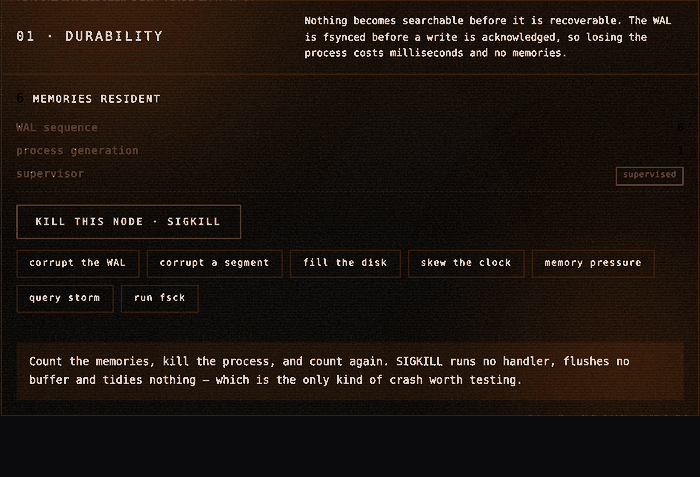

# AegisEdge

**An offline-first edge brain.** It remembers locally, answers in single-digit
milliseconds with no network, decides for itself what may leave the device, and
reconciles with its peers the moment a radio comes back.

Code Cubicle 6.0 — **Problem Statement 03**, AI-Powered Edge Memory & Intelligence Platform

[](https://github.com/akshatinnovate-png/AegisEdge/actions/workflows/ci.yml)


### Kill it and watch it come back



Six memories, `SIGKILL`, **six memories** — back in 3.6 seconds after replaying
six operations in 11.41 ms. `process generation` ticks to 2 because that is a
different process. SIGKILL runs no handler, flushes no buffer and tidies
nothing, which is the only kind of crash worth testing. Recorded from the
running console by `backend/scripts/capture_gif.py`; the button is in
**PROVE IT** and it is not a mock.

| | |
|---|---|
| **1,599 q/s** unique, **6,176 q/s** repeated | on four cores, no GPU |
| **60 writes acknowledged, SIGKILL, 60 recovered, 0 lost** | WAL replay in 126 ms |
| **0 invariant failures in 3,000 simulated executions** | 8.2 fleet-days, 1.97M operations |

Nothing here is mocked. Real pretrained weights compiled to ONNX at first boot,
real Qdrant, real ONNX Runtime. The node ships **empty** — whatever you see, you
put there.

---

## Prove it in sixty seconds

The strongest claim in this project is that a peer cannot lie to this mesh. It
is checkable without reading anything:

```bash
git clone https://github.com/akshatinnovate-png/AegisEdge.git && cd AegisEdge
pip install -r backend/requirements-dev.txt
cd backend

python3 scripts/simulate.py --seeds 200                          # ~2 min
python3 scripts/simulate.py --seeds 200 --unsigned --no-shrink \
        --stop-after 200                                         # ~20 s
```

```
  --seeds 200                        invariant failures     0 of 200
  --seeds 200 --unsigned             invariant failures   165 of 200
```

The same simulator, the same seeds, the same attacks. **Signed, nothing breaks.
Unsigned, a relay rewrites other devices' memories in flight and 165 of 200
executions catch it.** The control is kept runnable on purpose — a clean run
means nothing without a run that isn't.

**Or take GitHub's word rather than mine.** Both runs execute on every push, on
a clean machine, and the logs are public:
[CI run of this commit →](https://github.com/akshatinnovate-png/AegisEdge/actions/runs/36233821341/job/108381840747)

Every execution is a pure function of its seed, so a failure replays byte for
byte, forever. CI runs both on every push and **fails the build if the control
comes back clean**, which would mean the simulator had stopped attacking rather
than that the attack had stopped working.

---

## Run it

```bash
cd backend && uvicorn aegis.main:app --port 8000     # the node
cd frontend && python3 -m http.server 5173          # the console
```

Open **http://localhost:5173**. Three modes in the header:

| | |
|---|---|
| **USE IT** | The product. Capture a memory, ask a question, get a cited answer — with the policy rule that judged it shown beside it. |
| **PROVE IT** | Six claims, each with the button that falsifies it. Press **KILL THIS NODE · SIGKILL** and watch the count come back. |
| **INSPECT IT** | The machinery. Per-stage timings: understand, embed, plan, dense, sparse, fuse, rerank. |

Full instructions, the two-device mesh, and the one-command demo: **[docs/RUNNING.md](docs/RUNNING.md)**

---

## What it does

Five things the problem statement asks for, and where each lives.

| Requirement | How |
|---|---|
| Offline-first semantic memory | Tiered store on Qdrant, WAL fsynced before acknowledgement, crash-safe segments |
| Low-latency hybrid search, no network | Dense + sparse + RRF fusion + MaxSim reranking, all on-device |
| Local-vs-cloud decisions | A cost model calibrated on the device it runs on, and a policy engine that decides what may leave |
| Intermittent connectivity | A durable queue, an asymmetric connectivity oracle, and instant resumption |
| Edge↔cloud sync and conflicts | CRDT operation log, Merkle range digests, IBLT reconciliation, an arbiter that escalates genuine semantic conflicts rather than silently picking |
| User-facing inspection | Three console modes, every figure traceable to the endpoint that produced it |

Beyond the brief: peer-to-peer mesh with **no cloud and no coordinator**,
Ed25519 signing with fleet enrolment, on-device representation learning,
a bitemporal knowledge graph, conformal abstention, and an SLO ladder that
sheds stages to protect p99.

---

## Why this one is different

**Sixteen defects found and fixed, each with a regression test.** Not a feature
list — a record of things that were wrong.

Three of them came from a deterministic simulator that runs the whole fleet as
a pure function of one integer. The chain is the point:

1. The simulator found that **a relay could rewrite any operation in flight**
   and every downstream node accepted it. 453 of 500 executions.
2. Fixing it with Ed25519 signing exposed a **wire codec silently dropping the
   `sensitivity` label** — the field a receiving node reads to decide whether it
   may hold a memory at all.
3. Fixing *that* exposed the codec **editing signed content**: it quantized
   vectors on the way out, so every real upsert failed verification at the
   receiver and was refused as a forgery.

Each fix found the next bug. None was reachable by load testing.

The same seven invariants the simulator checks now run **against the live
node**, every two seconds, on a rolling budget — `/api/v1/integrity/invariants`
reports assertions beside violations.

Full account: **[docs/ENGINEERING.md](docs/ENGINEERING.md)**

---

## What does not work

Stated here rather than buried, because a system's limits are part of its
description.

- **~25 KB per memory is native, grows with the corpus, and is unexplained.**
  The vector index, operation log, points, embedded Qdrant, glibc arenas and
  allocator retention together account for about half. Each was isolated by
  removal; none is the bulk.
- **~2.8 KB/query resident growth**, with a one-variable reproducer:
  `scripts/repro_growth.py` shows 7 B/query without a sequential warm-up and
  2,771 with one. Eight causes ruled out by measurement. The obvious fix was
  measured and discarded.
- **Ingest decays with corpus size** — 67.5 to 48.7 docs/s over ten thousand
  memories.
- **Operation log compaction is not done.** Measured at 3.2 KB of 46.8, it
  buys ~7% in exchange for changing the one part signatures, gossip and the
  `bodies-intact` invariant all depend on. A confident plan, priced honestly,
  turned out to be a bad trade.
- **A remote Qdrant Server round trip and Triton escalation are untested here** —
  the org egress policy blocks the hosts, and this machine has no GPU. The
  clients are real; the round trip is not exercised.

---

## The repository

| | |
|---|---|
| **[docs/ENGINEERING.md](docs/ENGINEERING.md)** | The sixteen defects, the deterministic simulator, signing and enrolment, live invariants, and the scale investigation |
| **[docs/MEASUREMENTS.md](docs/MEASUREMENTS.md)** | Every measured number and the harness that produced it, including the full stress log |
| **[docs/ARCHITECTURE.md](docs/ARCHITECTURE.md)** | System shape, the feature plan, the API surface, and a module-by-module account of all 103 modules |
| **[docs/RUNNING.md](docs/RUNNING.md)** | Install, the three modes, two real devices gossiping, and how to check every claim |
| **[backend/README.md](backend/README.md)** | Module map, dependency matrix, configuration |
| **[testlogs/](testlogs/)** | Raw results: stress battery, simulation sweeps, bake-offs, screenshots |

**332 tests.** `cd backend && python3 -m pytest -q`

---

<sub>Everything measured on this machine: four cores, no GPU, no network after
install. Where a number depends on the hardware, the README says so.</sub>
