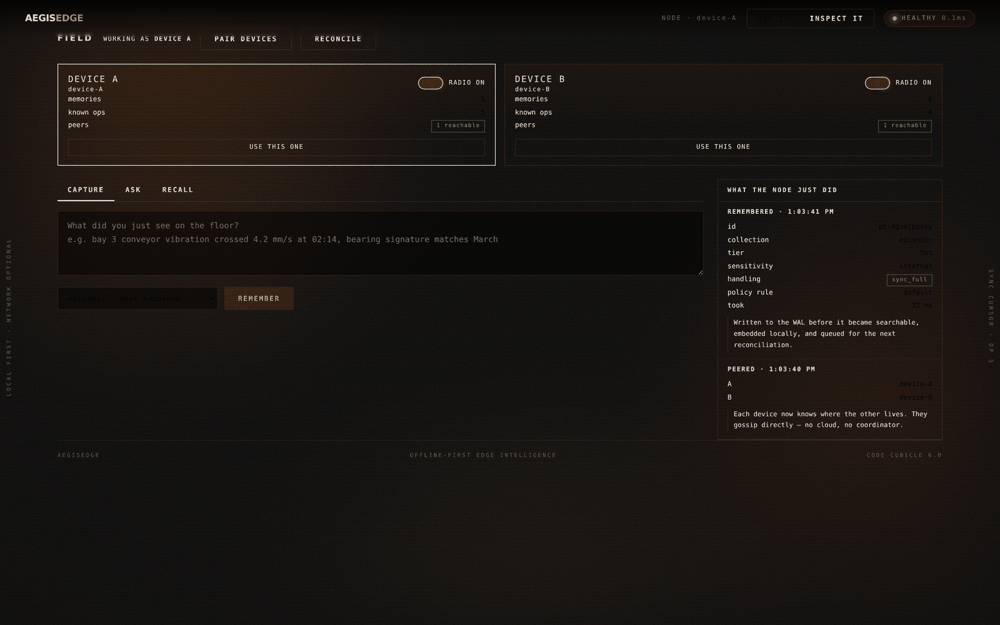
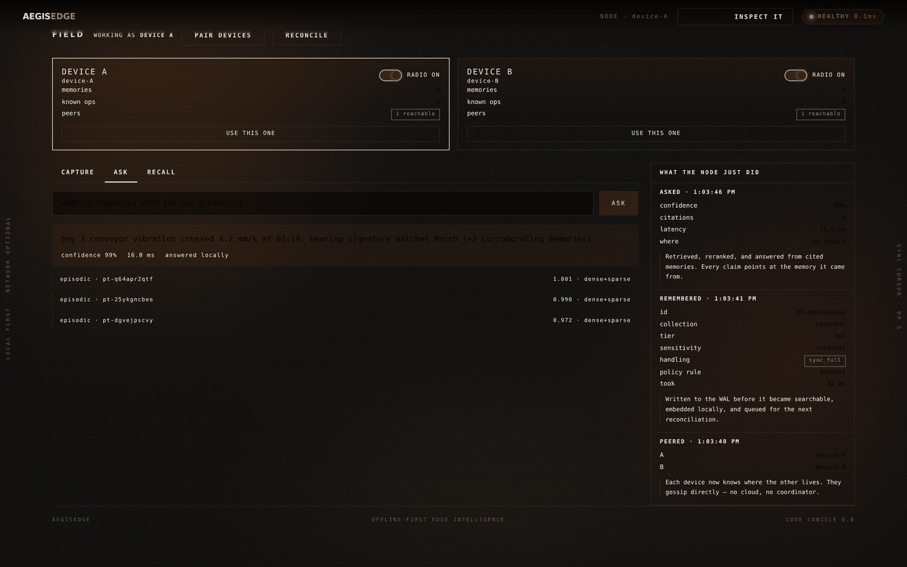
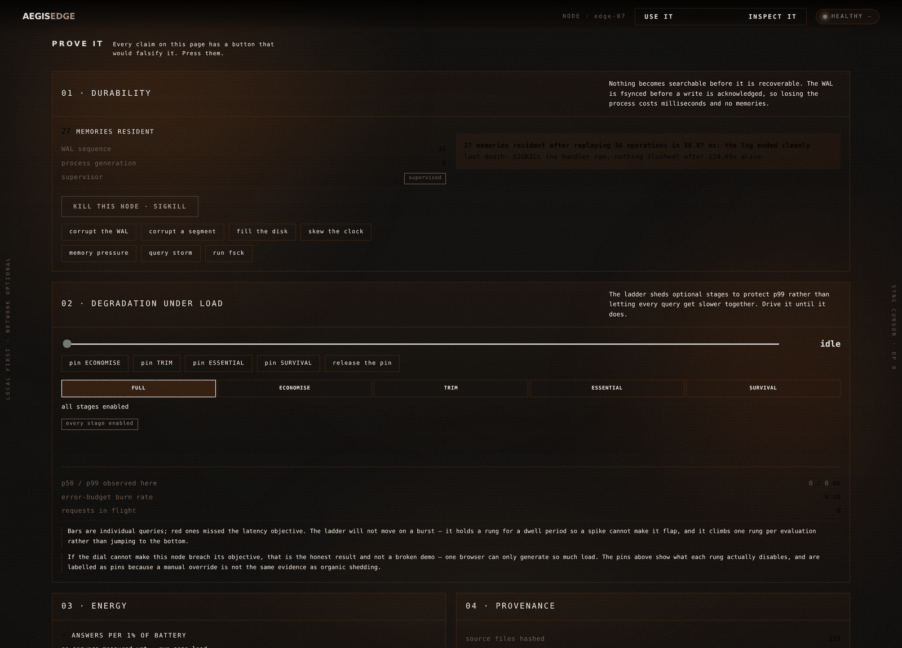
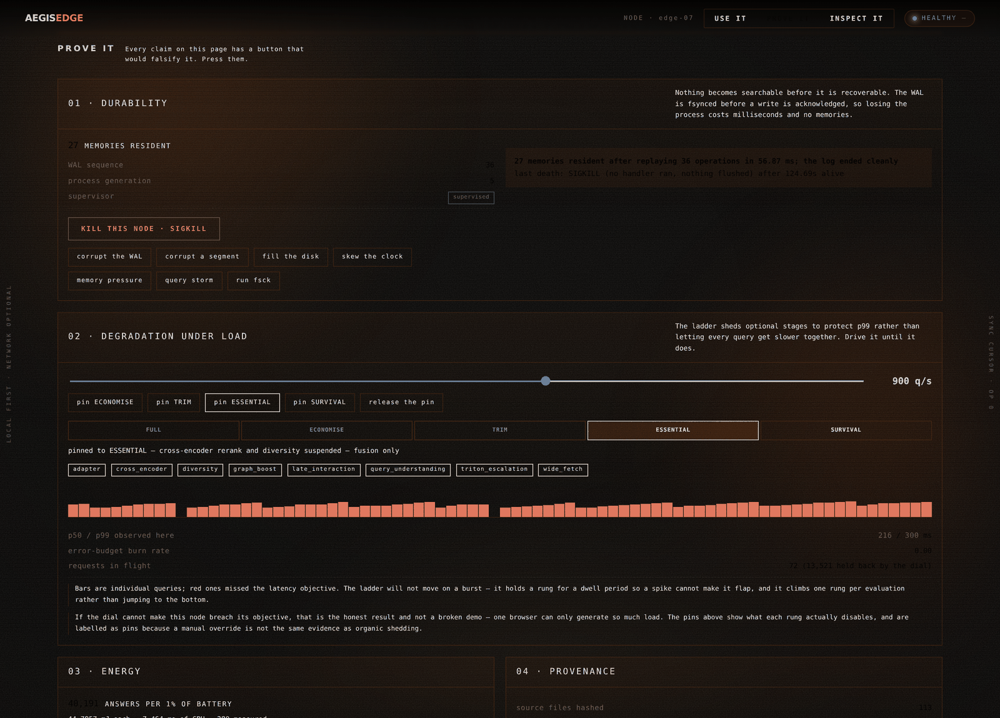
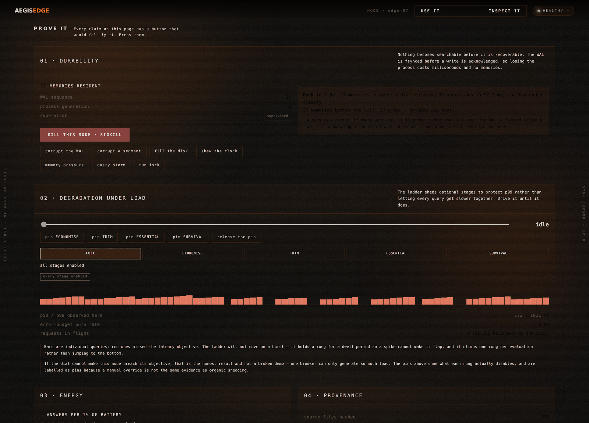
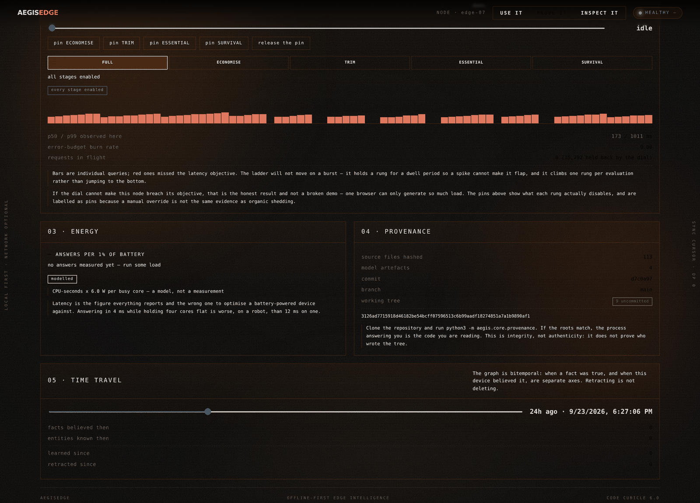
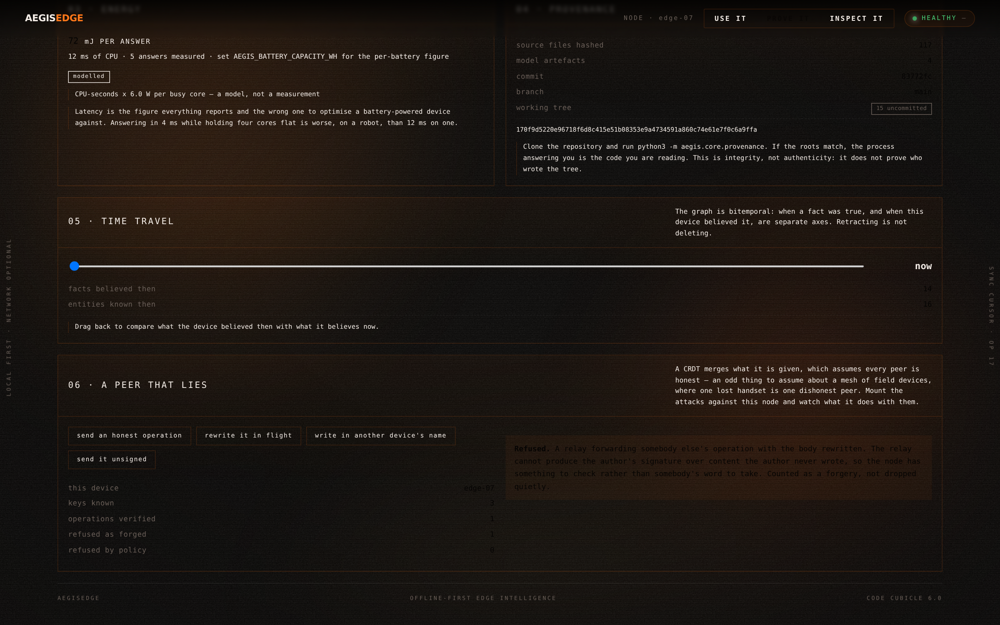

# AegisEdge

**AI-Powered Edge Memory & Intelligence Platform**
Code Cubicle 6.0 — **Problem Statement 03**

> An offline-first edge brain. It remembers locally, retrieves in single-digit
> milliseconds without a network, decides for itself what may leave the device,
> and heals its own state the instant connectivity returns.

---

## 0. The thesis

Most "edge AI" demos are a vector database running on a laptop. That is not an
edge system — it is a cloud system with the cable unplugged.

A real edge node has to survive things a cloud node never sees: the power dies
mid-write, the link flaps every ninety seconds, the embedding model is upgraded
while 400k vectors are already on disk, two devices edit the same memory while
partitioned, and the thermal governor halves your clock speed in the middle of a
query. AegisEdge is designed around those failures, not around the happy path.

The stack is built on **Qdrant Edge** for on-device semantic memory, **ONNX
Runtime** for local inference, and **NVIDIA Triton** for the heavy cloud tier,
joined by a sync protocol that treats disconnection as the normal state and
connectivity as the exception.

---

## 1. In action

Six frames, captured by `backend/scripts/capture.py` driving the real console
against a real node over HTTP. Nothing is mocked and no state is staged: the
corpus is ingested through the same path a deployed device uses, and the
degraded and offline frames are produced by actually pinning the degradation
ladder and actually dropping the link.

| | |
|---|---|
|  |  |
| **Cold boot.** A Windows-XP-era loading sequence while the node replays its WAL and compiles its ONNX graphs. | **Resolved.** The haze clears into the console once the node reports ready. |
|  |  |
| **Live, and repairing a typo.** `colent presure hard stop` — misspelled — returns 5 correct hits in **13.92 ms**, top result *"Coolant pressure below 1.8 bar…"*. Spelling repair runs against the local vocabulary, with no network and no spell-check service. | **Pinned to SURVIVAL.** The ladder sheds to dense retrieval only and suspends background work. The node still answers. |
|  |  |
| **Link down, still serving.** `OFFLINE`, sync `HOLDING`, and a query answered in **16.4 ms** from local memory. The event stream shows the ladder releasing itself: *"override released — evidence does not justify shedding"*. | **Reconnected.** Queued operations replay, divergence closes, and the restricted memory stays on the device — `held on device · local_only`. |


### 1.1 USE mode — two real devices, one truth

The console answers *is it working*. It never answers *what is it for*, so
there is now a second mode that does, reached from **USE IT** in the header.

| | |
|---|---|
|  |  |
| **Capture.** Write what you just saw. The rail on the right shows what the node did with it — the id it assigned, the tier it placed it in, what the classifier made of it, and which policy rule decided whether it may ever leave. | **Ask.** A cited answer at **99% confidence in 16.5 ms, answered locally**. Every claim points at the memory it came from, and when conformal calibration puts the answer below its coverage threshold the node says it does not know instead. |
|  |  |
| **Radio pulled.** Device A's mesh link is off. It keeps capturing and keeps answering — local memory is authoritative, and the write queues. | **Reconciled.** The radio comes back and anti-entropy moves exactly the operations the other side was missing: `A → device-B ↑1`. |

**The two devices are two real node processes**, not two tabs against one
backend. They discover each other by endpoint, gossip directly, and reconcile
over IBLT digests with **no cloud and no coordinator in between** — which is
the part of the problem statement that is easiest to claim and hardest to
show. `MeshLink` was always an in-process dispatch table with a docstring
promising a real transport would swap in behind it; `aegis/sync/meshlink.py`
is that transport, and nothing above it changed, because the seam
(`call(sender, target, method, payload)`) was already an RPC with the wire
left out. The peer on the other end receives it on
`POST /api/v1/mesh/exchange` and hands it straight to its own `GossipAgent`,
so both sides run one implementation of anti-entropy, causal delivery and
policy filtering rather than two that have to be kept in step.

**Every action shows its own machinery.** That is the point of the split: a
memory saved on the left produces, on the right, the policy rule that judged
it and the handling class it was given; a search produces the per-stage
timings — understand, embed, plan, dense, sparse, fuse, rerank — and says so
when it repaired your spelling against the local vocabulary, or when an
inferred narrowing matched nothing and was dropped rather than allowed to
return an empty page.

Run both devices:

```bash
cd backend
AEGIS_DATA_DIR=/tmp/devA AEGIS_NODE_ID=device-A AEGIS_MESH_TRANSPORT=http \
  uvicorn aegis.main:app --port 8201 &
AEGIS_DATA_DIR=/tmp/devB AEGIS_NODE_ID=device-B AEGIS_MESH_TRANSPORT=http \
  uvicorn aegis.main:app --port 8202 &
cd ../frontend && python3 -m http.server 5173
```

Then open `http://localhost:5173`, choose **USE IT**, and press **PAIR
DEVICES**. The console's own endpoint is still `window.AEGIS_API`; the pair is
`window.AEGIS_DEVICES`.


---

## 2. Measured, not claimed

Every number on this page comes from `backend/scripts/stress.py` on the
hardware it names. The full log is **[Appendix 1](#appendix-1--stress-test-log)**
and the raw results are committed under [`testlogs/`](testlogs/).

| | Measured |
|---|---|
| Embedding throughput | **29,421 docs/s** at batch 128, four cores, no GPU |
| Search p95 @ 20,000 points | **1.80 ms**, recall@10 **1.000** (exhaustive) |
| Ingest, full pipeline | 12,000 documents, **zero failures**, p99 30.8 ms |
| Adversarial payloads | 22 hostile inputs, **0 timeouts**, fsck clean, audit chain intact |
| Fault storm | 12 simultaneous faults, **190 queries answered, 0 failed**, p99 138.7 ms, 11/11 subsystems alive |
| Query throughput | **6,176 q/s** on repeated questions, **1,599 q/s** on questions never asked before, at 256 concurrent |
| Energy | **40,191 answers per 1% of a 50 Wh pack**, 44.8 mJ each |
| Mesh | 50 peers, 2,000 divergent ops, **50/50 converged in 7 waves**, 8,187 ops/s across the mesh |
| Durability | 27 memories, SIGKILL, **back in 2.9 s with 27 memories and nothing lost** |
| Soak | 150 s mixed read/write — and an **open memory finding**, below |

One line in that table is an admission rather than a result. A steady-state
soak — corpus held still, nothing written, queries only — shows the resident
set growing about **2.6 KB per query under concurrent load**, linearly over
64,000 queries with no plateau. Python objects, the ONNX memory arena, input
shapes, the encoder, the micro-batcher, tracing, metrics, the event bus,
background writes and allocator retention have each been measured and ruled
out, and two attempted fixes measured as doing nothing and were therefore not
kept. It is on the status list as open, with the reproduction. A README that
said "no unbounded growth" — as this one did until the soak was taught to hold
the corpus still — would have been wrong rather than reassuring.

Two figures are deliberately *not* on that list. AegisEdge does not do "billions
of inputs per millisecond" — that would be ~10¹² ops/s, several orders of
magnitude past this machine's memory bandwidth. The honest ceiling is **29
embeddings per millisecond** on this box, and the report says where it flattens
and why. And the shipped default tenant quota is **600 ingests/minute**, which
is the first ceiling anyone will hit — about 3,100× below what the inference
layer can sustain. The harness lifts it explicitly and records that it did,
because a stress test run with the production guardrail on is measuring the
guardrail.

---

## 3. What the stress runs broke

The point of a stress test is the things it breaks. Sixteen defects, each found
by pushing until something gave way and then reading what actually happened
rather than what was supposed to. All are fixed, with a regression test each —
and a seventeenth finding that is still open, because not finding the cause is
also a result.

Twelve came from load. The last four came from a different instrument
entirely — a deterministic simulator that runs the whole fleet as a pure
function of one integer, described in §3.1. Load testing asks whether the
system is fast. The simulator asks whether it is *right*, across orderings no
human would think to write down.

| # | Defect | What it cost |
|---|---|---|
| 1 | Vector append was quadratic — `np.vstack` copied the whole matrix per insert | **403× slower** inserts at 32k points; a scale run that never returned |
| 2 | Index migration ran inline on the write path | one write blocked **30.8 seconds** while a graph was built under it |
| 3 | Catastrophic regex backtracking in the PII classifier | one 1 MB ingest wedged the node for **79 minutes** at 100% CPU — a denial-of-service vector on an unauthenticated path |
| 4 | `slo.observe()` was called only in the HTTP layer | the degradation ladder was blind to every query from the WebSocket, agent, mesh or internal retrieval: **p99 1,850 ms** against a 150 ms target, burn rate **0.0**, nothing shed |
| 5 | The semantic cache was keyed on tenant alone | a `collection="*"` answer was served verbatim for a scoped query — **five hits from a collection holding nothing** |
| 6 | Inferred query narrowing applied as a hard filter | ordinary queries returned **zero** hits: `conveyor` → 5, `conveyor vibration night shift` → 0, on a corpus where every document contains all four words |
| 7 | The tokenizer encoded the whole input to keep 128 tokens | 1 MB query **853 ms → 35.5 ms**; the same text stored as a document paid it again on every rerank |
| 8 | In-flight sync outlived the storage handle | shutdown raised bare `RuntimeError` into un-awaited background tasks |
| 9 | **The semantic cache had never answered a question** | 0 entries, 0 hits, 0 misses across 128 queries — a `if not filters` guard that query understanding made true on almost every query. Fixed and moved in front of the encoder: **11.16 ms → 0.139 ms, 80×** |
| 10 | The index cost model chose the slower, less accurate structure | it picked HNSW from 5,000 points where flat was **4.9× faster and exact** — it had timed a graph hop as one vectorised call, capturing the arithmetic and none of the interpreter cost |
| 11 | The index calibration was not reproducible | consecutive calibrations on one machine derived crossovers between 40,000 and 110,000 points, so a node's index strategy depended on what else was running when it booted |
| 12 | A handling class did not survive the trip between devices | a memory marked for redaction at its origin arrived on the next device freely shareable, and that device's onward decisions rested on a class it never had |
| 13 | Egress policy was enforced on the sender only | a device that skips its own filter — buggy or compromised — pushed a never-leaves-the-device memory to every peer, and each stored it without a murmur. Found deterministically at **seed 5**, and found there every time |
| 14 | **Operations had no integrity protection at all** | a relay could rewrite the body of somebody else's operation in flight and every downstream node accepted the altered version. **453 of 500** simulated executions found it |
| 15 | Operation ids were drawn from the wall clock | the ids the IBLT hashes and a fetch is sorted by were not part of the seeded execution, so two sweeps over the same 500 seeds returned **454 failures, then 456** — close enough to read as noise, and a flat contradiction of the claim that a run is a pure function of its seed |
| 16 | The wire codec silently dropped body fields | it elided a repeated field against encoder state that outlived the frame, while the decoder started empty on every frame. The second operation carrying `sensitivity: restricted` arrived with **no sensitivity label at all** — and that label is exactly what the receiving node reads to decide whether it may hold the memory |

Three of these deserve more than a row.

**The classifier hang (3)** is the one that matters most, because it is
reachable by anyone who can write a memory. The pattern was
`[\w.+-]+@[\w-]+\.[\w.]+`. Against a megabyte of word characters the local
part matches greedily to the end, fails to find the `@`, backtracks the whole
way, and the engine restarts from the next offset — measured at exactly **4× the
time for 2× the input**, extrapolating to 79 minutes for a single 1 MB write.
The classifier sits on the ingest path *by design*, so it cannot be bypassed,
which is also why one write could take the device off the air. Anchoring the
pattern fixed the bug; the scan now also runs in overlapping windows so no
future pattern can be handed an unbounded string. Truncating was rejected — this
is a security control, and a secret at offset two megabytes must not escape
classification because scanning it was inconvenient. **79 minutes → 199 ms**,
flat at 199 µs/KB from 32 KB to 4 MB.

**The blind ladder (4)** was advertised as the thing that protects p99 under
load, and it could not see the load. A burn rate of exactly 0.0 across 2,688
queries is not a controller choosing to hold; it is a controller with an empty
input. The observation now happens in the pipeline, where every query passes
regardless of transport. The HTTP layer keeps the failures — which never reach
the pipeline — and gives up the successes, which would otherwise be counted
twice and halve the apparent breach rate.

**The dead cache (9)** is the one that cost the most performance and hid the
longest. The guard read as conservative — a filtered result is not cacheable by
vector alone — but query understanding infers a collection filter on most
queries, so it was almost always true. Filters belong *in the key*, not in a
condition that skips the cache. Fixing the key raised the hit rate and bought
almost nothing, because the lookup happened *after* the encoder ran: a hit was
still paying for the most expensive part of the query it existed to avoid. So
there is now an exact layer in front of the embed, and a hit in the vector
layer teaches it — a cache that only learns from full work never learns from
itself.

**A note on the bake-off guard.** The cost model's crossover is derived from
what the device measures, which is the design — and it means the bake-off's
conclusion ("flat wins to 20,000 points") is binding only on a machine like the
one it was measured on. On a container whose numpy takes **7 ms** for a
2048×256 matvec — about 75 MFLOP/s, two orders of magnitude off a healthy CPU —
the linear scan really is slower than a graph walk at that scale, and a model
preferring the graph there is the model working.

The guard used to assert the bake-off's *conclusion* directly, so it failed on
such a machine and read as a regression in code that had not changed. It is now
three assertions that hold on any device — an honestly timed hop must cost
measurably more than a vectorised one (which is the actual defect, timed both
ways on the same data); the calibration must be stable across consecutive runs;
and `choose` must have the right shape around the model's own crossover — plus
the bake-off assertion, which now measures the machine first and **skips with
the measurement in the skip reason** rather than failing quietly or passing
vacuously.

**The empty results (5 and 6)** are the pair that would have ruined a demo.
Query understanding read "conveyor vibration night shift" as sensor intent and
applied `collection="sensor"` as a hard filter, though the caller asked for
`*`; the cache bug had been hiding it by serving the unscoped answer to every
scoped query. Inferred narrowing is now advisory: when it matches nothing the
query is retried at the scope the caller asked for, and the result records what
was dropped. Only what *this layer* added is ever backed out — an explicit
filter is obeyed even when it matches nothing, and tenant isolation is
explicitly excluded, because an empty visible set is a boundary, not a bad
guess, and retrying wider there would turn a correct empty answer into an
isolation breach.

---

## 3.1 Deterministic simulation — a seed for every bug

Load testing answers "is it fast?". It cannot answer "is it correct under an
ordering I did not think of?", because the orderings that break distributed
systems are the rare ones, and a load test explores whichever orderings the
operating system happens to hand it.

So the whole fleet was made reproducible. `aegis/core/determinism.py` holds a
swappable ambient environment; inside `simulated(seed)`, `determinism.now()`,
`determinism.monotonic()`, `determinism.rng()` and `determinism.sleep()` are
served by a virtual clock and a seeded generator. Time moves only when the
simulation moves it, and `await sleep(3600)` advances an hour and returns
immediately.

The consequence is the point: **an entire distributed execution becomes a pure
function of one integer.** Twelve peers, four hundred steps, partitions,
crashes, clock skew and three Byzantine attacks — all of it replays byte for
byte from the seed. A failure found once is a failure that can be found again,
on any machine, forever.

### The lint that keeps it true

One `time.time()` left in a simulated module and a seed silently stops
reproducing — the run still passes, it just no longer means anything. So it is
not a convention, it is a build step:

```bash
python3 scripts/audit_determinism.py
#   skip  aegis/sync/compression.py   (no clock or randomness in a codec)
#   skip  aegis/sync/meshlink.py      (measures real RTT to a real peer over HTTP)
#   skip  aegis/sync/transport.py     (network clients own their own timeouts)
#   skip  aegis/core/determinism.py   (it *is* the environment)
#
#   12 simulated modules draw time and randomness from the environment.
```

It is an AST pass, not a grep, and each exemption carries the reason it is
exempt. It also checks that a module reaching for `determinism` actually
imports it — a rule added after two modules were converted without their
import and the *test suite* found out rather than the linter. The failure mode
there is a `NameError` on a clock call that only runs under load or during
recovery, a long way from the change that caused it.

The list of modules it covers was also learned the hard way. Two sweeps over
the same 500 seeds returned **454** failures and then **456**. Two out of five
hundred reads as noise; it was not noise. Operation ids came from
`time.time()` and `os.urandom`, and an operation id is not cosmetic — it is
what the IBLT hashes and what a fetch is sorted by, so reconciliation was
drifting while every other part of the execution replayed perfectly. Ids now
come from the environment, the per-millisecond counter is reset when a
simulation begins, and `ids.py` is inside the lint's scope. The two sweeps now
agree exactly: same failing seeds, same details, the same 78,249 operations
exchanged.

That is the mechanism working on itself. A simulator whose own instrument
drifts produces numbers that look like measurements.

### What the world can do

`aegis/sim/world.py` draws each step from a weighted population:

| Action | Weight | What it does |
|---|---|---|
| `write` | 34 | a device records a memory; 15% are marked never-leaves-the-device |
| `gossip` | 30 | one anti-entropy round between two peers |
| `partition` / `heal` | 8 / 8 | cut and restore a link |
| `skew` | 6 | step a clock, in either direction |
| `crash` | 5 | lose everything a device had not yet shared |
| `duplicate` | 5 | a peer redelivers what it already sent |
| `forge_clock` | 4 | a peer stamps an operation a century ahead so it wins every conflict — **signed honestly**, so only a bound on the clock can stop it |
| `impersonate` | 4 | a peer writes an operation in another device's name |
| `tamper` | 4 | a relay forwards somebody else's operation with the body rewritten |
| `idle` | 4 | time passes and nothing happens, which is most of a real device's life |

After **every** step, seven invariants are checked:

| Invariant | The promise |
|---|---|
| `no-fabrication` | no device holds an operation no device ever wrote |
| `policy` | a never-leaves-the-device memory is on exactly one device |
| `origin-retains` | the device that wrote a memory still has it |
| `no-duplicates` | redelivery never double-applies |
| `clock-monotonic` | a device's own clock never goes backwards in its log |
| `clock-not-poisoned` | one peer claiming the future cannot drag the fleet there |
| `bodies-intact` | what a device reads is what the author wrote |

When one breaks, the run stops and a delta-debugging shrinker takes over:
remove one action, replay, does it still fail? What survives is the shortest
history that still reproduces it — usually short enough to read in full.

### What it found

**Seed 5, immediately: egress policy was enforced on the sender only.** A
restricted memory written on `edge-01` was sitting on `edge-03`. The sending
side filtered correctly; the receiving side simply believed what it was handed.
That is right for an honest peer and worth nothing against a compromised one,
and a mesh of field devices is a population where "one handset is lost" is a
Tuesday. The receiver now enforces its own policy on arrival, counts what it
refuses, and says so on the event bus.

**Then the one that mattered: operations had no integrity protection at all.**
The `tamper` action — a relay forwarding an operation with the body rewritten —
was accepted by every downstream node in **453 of 500 executions** — every one
of them the same invariant, `bodies-intact`. The signed build runs the same
seeds, with the same attacks still firing, and the invariant holds.

The full signed sweep, with the results committed:

```
deterministic simulation  3,000 executions · 400 steps · 6 peers · signed

  3,000 executions in 4456.2s real time
  simulated            704,174 seconds (8.2 fleet-days)
  operations exchanged 1,973,405
  invariant failures   0 of 3,000 executions run
  no counterexample found. That is not a proof — it is 3,000 executions
  without one.
```

**8.2 fleet-days of a six-device mesh, just under two million operations
exchanged, seven invariants checked after every one of 1.2 million steps, and
nothing broke.** The last sentence of that output is the script's own, and it
is there because the alternative — printing "verified" — would be a lie about
what a sweep is. It samples the space of orderings. It does not cover it.

```
deterministic simulation  500 executions · 400 steps · 6 peers · unsigned (control)

  FAIL seed 497 · bodies-intact · edge-02 holds 01HF7YRWDT4K5PZCZ5XH04JDGT
                  with content that differs from what edge-04 wrote
  ...
  500 executions in 63.5s real time
  operations exchanged 78,249
  invariant failures   453 of 500 executions run
```

The control is kept runnable — `--unsigned` is a flag, not a deleted commit.
A defence you cannot switch off is a defence you can no longer demonstrate
works, and "the attack no longer fires" is only meaningful next to a run where
it does.

Worth being precise about why the Byzantine invariants initially found
*nothing*: the first sweep came back clean, because the invariants were not
watching what the attacks targeted. `clock-not-poisoned` and `bodies-intact`
were added *because* a clean result from an adversarial run is a claim about
the invariants, not about the system. A simulator that cannot fail is a
simulator that cannot tell you anything.

### The fix: every operation says who wrote it

`aegis/sync/identity.py`. Each device holds an Ed25519 key pair, persisted
beside its data — an identity regenerated at boot is not an identity, because
every peer would see the key change and, correctly, refuse everything the
device had ever said.

The signature covers `op_id`, `kind`, `point_id`, `hlc`, `device_id` and
`body`, over canonical sorted-key JSON, so two encodings of the same operation
produce the same signature. `ts` is deliberately *outside* the signature — a
relay may touch routing, it may not touch content — and there is a test that
fails if anyone widens that set without meaning to.

Measured on this hardware: **62 µs to sign, 129 µs to verify, 88 bytes on the
wire.** Against an 18 ms ingest that is 0.7% — and verification happens on
receipt, not on the query path.

Key distribution is trust-on-first-use, and the limit is written down rather
than glossed:

- The first key a device presents for an identity is believed.
- Any *later* change to that identity's key is refused, loudly, as an
  `identity_conflict` event.
- Keys travel with operations, so `edge-02` can verify an `edge-00` operation
  relayed by `edge-01` without ever having met `edge-00`. Without that,
  signing would break the partition tolerance it exists to protect.
- **This does not defeat an attacker present at the very first contact.**
  Closing that needs an enrolment authority, which is a deployment decision
  rather than a library one.

What it does defeat, with a regression test each: rewriting an operation in
flight, writing in another device's name, and taking over an identity that is
already in use.

### The bug underneath the bug

Turning signing on broke honest convergence — 6 operations out of 28 reaching
their peers. The signatures were valid at rest and invalid on arrival, which
meant something between the two was changing the operation.

It was the wire codec. It elided a repeated low-cardinality field — one of
which is `sensitivity` — against a dictionary that lived on the **encoder** and
survived across frames, while the decoder started from an empty context on
**every** frame. The first operation carrying `sensitivity: restricted` sent
the label. Every later one sent a hole. Every hole was dropped.

That is worse than a compression bug, because the receiving node decides
whether it may hold an operation by reading exactly that field. An operation
the policy would have refused arrived looking ordinary — and the receive-side
check added at seed 5 was reading a label the compressor underneath it had
already removed.

Cross-frame state was never sound here anyway: this transport drops, reorders
and duplicates frames, so "the value from the previous frame" is not something
a receiver can know. The context is now rebuilt per frame and never survives
one; a hole with nothing to fill it from raises rather than passing silently.
Compression is barely affected, because the redundancy that pays for it is
*within* a batch.

**This is the argument for signing, stated as cleanly as it can be stated.**
Signing did not prevent this bug. Signing *revealed* it — a silent data-loss
path, sitting on a security control, that four hundred passing tests and nine
phases of load testing had not touched.

### Running it

```bash
cd backend
python3 scripts/audit_determinism.py                          # the lint
python3 scripts/simulate.py --seeds 3000 --steps 400 --peers 6 \
        --out ../testlogs/simulation.json                     # the sweep
python3 scripts/simulate.py --seeds 500 --unsigned --no-shrink # the control
python3 scripts/simulate.py --replay 5                        # see one seed again
```

A clean sweep is **not a proof**, and the script says so in its own output: it
is "no counterexample in N executions", with N printed so a reader can judge
it. It samples the space of orderings; it does not cover it.

---

## 4. On-device representation learning

The node can fit a better embedding space for its own corpus than the one it
shipped with — and it is not allowed to believe that without proving it.

**The shipped space is badly conditioned.** Measured on the real encoder over
8,000 documents: unrelated documents sit at cosine **0.285**, and the
256-dimensional space has an **effective rank of 29.5**. Most of what a cosine
score reports is a common component every vector shares.

**So the device measures its own covariance** and fits a whitening transform,
with Ledoit–Wolf shrinkage so it never inverts an estimate it cannot support.
A packing line and a clinic converge on different transforms, because they see
different data, and neither needed a network to learn it.

**Rank selection is not optional, and finding that out cost a bug.** Whitening
at full dimension amplifies ~220 near-zero directions by four orders of
magnitude; it took cold-tier recall@10 from 0.77 to **0.11**. The transform now
keeps a rank bounded by both retained energy and a conditioning floor.

**Nothing is armed without evidence.** `AdaptationGate` builds a paraphrase
task out of the node's own memories — delete half a stored document's words,
and the document it came from is the correct answer by construction, so no
labels are needed — and adopts a candidate only when a **paired bootstrap** puts
the 95% confidence interval clear of zero. That is not ceremony: whitening
measured **+0.0175 MRR on one probe sample of the same corpus and −0.0001 on
another**. The gate rejects at 250 probes, rejects at 400 (+0.0092, CI still
spans zero), and adopts at 600 (**+0.0221, CI [+0.0059, +0.0371]**).

**And the gate earns its keep by rejecting things.** Smooth Inverse Frequency
pooling is one of the most cited results in sentence embedding, and it needs no
graph change here — the pooling graph computes `sum(emb·mask)/sum(mask)`, so
real-valued weights in place of the 0/1 mask make it a weighted mean exactly.
It also makes retrieval monotonically **worse** on this model: MRR@10 0.7827 →
0.7457 at a=1e-3, → 0.6376 at a=1e-4. The token table is a distillation trained
*for* mean pooling, so it has already absorbed the correction SIF exists to
apply. Shipping it on the strength of the citation would have cost ~5% of
retrieval quality, silently, on every device. It ships off.

**Measuring never arms anything.** The winning transform changes the output
dimension 256 → 195, so switching it on without re-embedding the corpus would
leave stored vectors and queries in differently shaped spaces — not a
degradation but nonsense, which no retrieval metric would report. Arming is an
explicit call behind a renewal migration, and the API refuses it while any
stored vector is still in the old space.

### 4.1 RaBitQ: 1-bit codes that know how wrong they are

The cold tier stored `sign(v)` — 32× compression, silently lossy, and no way for
anything downstream to reason about the loss, so the only safe use was a fixed
6× over-fetch that nobody could justify. RaBitQ (Gao & Long, SIGMOD 2024)
replaces the proxy with an **unbiased estimator and a concentration bound**:
centre on the corpus centroid, apply a random orthogonal rotation (a fast
Hadamard construction, O(d log d), when the dimension is a power of two), and
keep one float for how well each code aligns with the vector it encodes.

| | sign bits | RaBitQ |
|---|---|---|
| recall@10, raw space, 6× shortlist | 0.938 | **0.997** |
| recall@10, whitened space | 0.675 | **0.893** |
| bias | — (not an estimator) | **< 1e-3** |
| bound holds | no bound | **99.1–99.4%** against a stated 98.5% |
| bytes/vector @ d=256 | 32 | 40 |

Eight bytes per vector to turn a guess into a bound — and the bound then
replaces the guess. The k-th largest *lower* bound is a score the true top-k
provably reaches, so any candidate whose upper bound falls short is never
fetched from disk. Easy queries collapse to a handful of reads, ambiguous ones
widen by themselves, and a latency budget caps it when the bound stops being
informative — recorded when it binds, because a guarantee that silently lapsed
is worse than one never claimed.

### 4.2 The index strategy was choosing wrong

`scripts/strategy_bakeoff.py` forces each strategy onto the same corpus, because
"the adaptive index never switched" is either a cost model working or a cost
model broken, and only a measurement can say which:

| 20,000 points | p50 | recall@10 | build |
|---|---|---|---|
| **flat** | **0.886 ms** | **1.000** | 0 s |
| hnsw | 4.340 ms | 0.773 | 252 s |
| ivf_pq | 550.512 ms | 0.997 | 123 s |

Exhaustive search was **4.9× faster than the graph**, exact where the graph lost
a quarter of its recall, and free to build — and the cost model was selecting
the graph from 5,000 points upward. It timed a hop as one vectorised numpy call,
capturing the arithmetic and none of the per-node interpreter bookkeeping that
actually dominates. The overhead ratio came out ≈1 and the crossover collapsed
onto its floor.

It only failed to make anything *worse* because index migration is deferred to
the maintenance lane, which the scale runs never reach — a latent
misconfiguration masked by an unrelated fix. The hop is now timed with its
bookkeeping (overhead **12.1×**), and the crossover is solved from the two
measurements: **110,000 points**, with the model predicting 4.82 ms for HNSW at
20k against a measured 4.34 ms.


---

## 4.3 PROVE IT — four claims, each with the button that would falsify it

Every team claims. Almost none invite verification, because offering to be
checked only works if you would survive it. A third mode, **PROVE IT**, is the
offer.

| | |
|---|---|
|  |  |
| **The panel.** Durability, degradation, energy, provenance and time travel — each with the control that would break it if the claim were false. | **Under load, at a pinned rung.** ESSENTIAL suspends eight stages *by name*; in-flight requests are capped and what the cap holds back is counted. |
|  |  |
| **SIGKILL, from the browser.** No handler runs, no buffer is flushed, nothing is tidied. | **Back in 2.9 s.** 36 operations replayed in 52.7 ms. *27 memories before the kill, 27 after — nothing was lost.* |

### Hand the judge the crowbar

`scripts/supervise.py` runs the node as a child and restarts it, recording each
death: which signal, how long it lived, whether it was a hard kill.
`POST /api/v1/chaos/kill` lets somebody with a browser and no terminal pull the
rug out. SIGKILL is the default because it is the only interesting one. The
endpoint **refuses unless a supervisor is present** — a kill button with
nothing behind it is not a demonstration, it is the end of the demo.

`GET /api/v1/integrity/recovery` then answers the only question that matters
after a crash, in the terms the claim was made in. A torn tail record is
reported and explained rather than glossed: the WAL is fsynced *before* a write
is acknowledged, so a half-written record is one whose caller never got an
answer, and discarding it is the only correct thing to do.

Beside it, every fault the chaos controller knows — corrupt the WAL, corrupt a
segment, fill the disk, skew the clock, memory pressure, query storm — and
`fsck` to check afterwards.

### Joules, not milliseconds

**40,191 answers per 1% of a 50 Wh pack, at 44.8 mJ each.** Latency is the
figure everything reports and the wrong one to optimise a battery-powered
device against: answering in 4 ms while holding four cores flat is worse, on a
robot, than 12 ms on one core.

Three sources, tried in order, and every reading says which produced it — the
CPU package's RAPL counter, battery discharge, or CPU-seconds times an assumed
per-core draw. The first two are measurements. The third is a **model**, and it
is labelled `modelled` everywhere it appears, because a model dressed as a
measurement survives exactly until somebody checks it. The coefficient is
configuration rather than a constant buried in a module: the right value for a
Xeon and an A78 differ by an order of magnitude and only the deployer knows
which they have.

### The receipt

A demo is an assertion, and nobody watching one can tell a node running the
committed code from a node running a branch with the hard parts stubbed. So the
node computes, at runtime, a **Merkle root** over its own source, the weights
it loaded and the graphs it compiled from them:

```bash
python3 -m aegis.core.provenance        # in a clean clone
curl localhost:8000/api/v1/provenance   # on the running node
```

If the roots match, the process answering you is the code that is public. A
tree rather than a flat hash, so a mismatch is *located* file by file. A dirty
working tree is reported, not hidden. And the receipt states its own limit:
this is integrity, not authenticity — it proves the running process matches a
tree with this root, not who produced the tree.

### Degradation you can drive

A dial that issues real queries, and the ladder lighting up as the node sheds.
Two honesty fixes were needed to make the reading mean anything. At 900 q/s the
browser had 1,333 fetches outstanding and the panel reported a p50 of 3.6
seconds while the node's own burn rate sat at zero — the node was fine and the
*browser* was the bottleneck; in-flight requests are now capped and what the
cap turns away is counted and shown. And one browser may simply be unable to
make a node breach its objective, which is an honest result rather than a
broken demo: the panel says so instead of manufacturing a stall, and the rung
pins beside the dial are labelled as pins, because a manual override is not the
same evidence as organic shedding.

### Time travel



A slider over the last 72 hours: what this device believed then, and what it has
learned or retracted since. The bitemporal graph has been in the system all
along and nothing had ever surfaced it.

### A peer that lies



Four buttons, four attacks, run against the node serving the page. Each one
builds a real `Operation`, encodes it with the real wire codec and hands it to
the same `GossipAgent.handle` a peer device reaches over `/mesh/exchange` —
nothing is staged, and the only thing the route knows that a peer does not is
the attacker's own key, which it uses exactly as an attacker would.

| Button | What it sends | What should happen |
|---|---|---|
| send an honest operation | signed by the device that wrote it | **accepted** |
| rewrite it in flight | somebody else's operation, body changed, original signature kept | refused |
| write in another device's name | the attacker's signature under the victim's `device_id` | refused |
| send it unsigned | no signature at all | refused |

The honest case is on the card for a reason: it is the control. A node that
refused everything would pass the other three for entirely the wrong reason,
and a panel that only ever shows refusals cannot tell the difference. The card
reports the node behaving *as claimed*, which for the first button means
accepting — and if an outcome is ever wrong, it says "wrong outcome" on screen
rather than in a log.

The counters beside it are the node's own: operations verified, refused as
forged, refused by policy on arrival. They are read from `/api/v1/mesh/status`,
the same endpoint anything else would use.

---

## 5. System shape

```
                          ┌───────────────────────────────────────────┐
  CONTROL PLANE           │  Tenants · API keys + scopes · Quotas     │
                          │  Policy (hot-reload) · Hash-chained audit │
                          │  SLO objectives · Degradation ladder      │
                          └────────────────────┬──────────────────────┘
                                               │ governs every plane below
╔══════════════════════════════════════════════▼══════════════════════════════════════════════╗
║  EDGE NODE — offline-capable, multi-tenant, self-healing                                     ║
║                                                                                              ║
║  INGEST PLANE                                                                                ║
║   ingest ─▶ quota gate ─▶ sensitivity classifier ─▶ policy engine ─▶ redaction vault          ║
║                 │                    │                    │                                  ║
║                 ▼                    ▼                    ▼                                  ║
║        ONNX embedder          entity + relation     sync class decision                      ║
║        (EP ladder,            extraction            (local / redacted /                      ║
║         µ-batch, int8)              │                metadata / full)                        ║
║                 │                   ▼                      │                                 ║
║                 │        ╔══════════════════════╗          │                                 ║
║                 │        ║ BITEMPORAL KNOWLEDGE ║          │                                 ║
║                 │        ║ GRAPH                ║          │                                 ║
║                 │        ║ valid-time ⊥ tx-time ║          │                                 ║
║                 │        ║ retract ≠ delete     ║          │                                 ║
║                 │        ╚═══════════╤══════════╝          │                                 ║
║                 ▼                    │                     ▼                                 ║
║  STORAGE PLANE  │                    │        write-ahead log (CRC, torn-tail safe)          ║
║   ┌─────────────▼────────────────────┼───────────────────────────┐        │                  ║
║   │ ADAPTIVE INDEX  (cost model calibrated on this silicon)      │        ▼                  ║
║   │   FLAT BLAS  ⟷  HNSW graph  ⟷  IVF-PQ + OPQ (64× smaller)    │  immutable segments       ║
║   │   sparse postings (BM25/SPLADE) · payload index + stats      │  content-addressed        ║
║   │   HOT full ▸ WARM int8 ▸ COLD 1-bit + vectors on memmap      │  manifest (atomic swap)   ║
║   └─────────────┬────────────────────────────────────────────────┘  fsck · scrub · PITR      ║
║                 │                                                        │                   ║
║  RETRIEVAL PLANE▼                                                        ▼                   ║
║   understand (BK-tree repair · expansion · intent · units/time)    self-healing repair        ║
║        ▼                                                          (peer ▸ cloud ▸ report)    ║
║   cost-based planner ─ pre-filter │ post-filter │ scan │ provably empty                       ║
║        ▼                                                                                     ║
║   dense ⊕ sparse ─▶ RRF ─▶ cross-encoder ─▶ MaxSim late interaction ─▶ on-device adapter      ║
║        ▼                                                                                     ║
║   graph boost (spreading activation) ─▶ MMR diversity ─▶ CONFORMAL prediction set             ║
║        ▼                                                          (coverage guarantee /       ║
║   agentic reasoner: plan ▸ retrieve ▸ verify ▸ cite                honest abstention)          ║
║                                                                                              ║
║  RUNTIME PLANE                                                                               ║
║   QoS scheduler (interactive ▸ sync ▸ maintenance ▸ renewal, deadlines, shedding)             ║
║   supervisor · span tracing · metrics · thermal/power governor · chaos injection              ║
║   event bus ─▶ multiplexed WebSocket gateway                                                 ║
╚═══════════════╤══════════════════════════════════╤═══════════════════════════════════════════╝
                │                                  │
     ┌──────────▼───────────┐         ┌────────────▼─────────────────────────────┐
     │  PEER MESH           │         │  intermittent, hostile, lossy uplink      │
     │  IBLT reconciliation │         │  QUIC 0-RTT · circuit breaker · hedging   │
     │  vector clocks +     │         │  token-bucket budget · resumable cursor   │
     │  causal delivery     │         └────────────┬─────────────────────────────┘
     │  gossip + rumour     │                      ▼
     │  policy at the edge  │      ╔═══════════════════════════════════════════════╗
     └──────────┬───────────┘      ║  CLOUD TIER                                   ║
                │                  ║  Sync coordinator · Qdrant Server (canonical) ║
                └──────────────────║  Triton (ensembles, dynamic batching)         ║
       device ⇄ device, no cloud   ║  Renewal orchestrator · Fleet registry        ║
                                   ║  Conflict arbiter · Federated aggregator      ║
                                   ║  (secure aggregation — never sees an update)  ║
                                   ╚═══════════════════════════════════════════════╝
```

Four properties the diagram is making claims about, each checked by a test:

1. **Nothing crosses a boundary it was not allowed to** — not to the cloud, not
   to a peer, not to another tenant, not through the cache, at any degradation
   level.
2. **Every accepted write is either resident, durable, or reported lost** — by
   identifier, never silently.
3. **A query is always answered or fails loudly** — the ladder sheds stages
   rather than letting latency run away.
4. **Every claim about confidence is calibrated** — coverage is measured
   against realised outcomes, not asserted.

---

## 6. Backend feature plan

### 6.1 Memory core — Qdrant Edge

| Feature | Detail |
|---|---|
| Qdrant is required | Qdrant is a **hard dependency**, embedded by default and reported verbatim in `/health` as `qdrant-local` or `qdrant-server`. A node that silently falls back to an internal store while claiming to be Qdrant-backed is telling its operator something untrue about where their data lives. `AEGIS_REQUIRE_QDRANT=0` allows the internal store *explicitly*. |
| Two paths, verified to agree | Qdrant owns persistence and the collection API; the local adaptive index serves hot queries. `verify_agreement()` proves the two return the same neighbours instead of asking anyone to assume it — **100% overlap** measured. |
| Same code, server or embedded | `AEGIS_QDRANT_URL=http://host:6333` moves the same adapter onto a Qdrant Server, where the engine is Rust and the trade-off flips. |
| Single-writer, stated | Embedded Qdrant takes an exclusive lock on its directory. A second node on the same `AEGIS_DATA_DIR` gets a message that says so, not a `BlockingIOError` from three libraries down. |
| Hybrid vectors | Every point carries a **dense** vector (`bge-small-en-v1.5`, 384d) *and* a **sparse** vector (SPLADE-mini / BM25 fallback) so lexical rare-token matches survive offline. |
| Named vector spaces | Multi-vector points: `text`, `vision`, `audio`, `fused` — one point can be retrieved through any modality. |
| Scalar + binary quantization | INT8 scalar quantization on the hot tier, **binary quantization** on the cold tier for a 32× memory drop, with rescoring from the full vectors on disk. |
| Payload indexing | Keyed indexes on `ts`, `geo`, `device_id`, `sensitivity`, `model_version`, `ttl` to keep filtered search pre-filtered rather than post-filtered. |
| Memory tiering | **Hot** (mmap'd, full precision) → **Warm** (INT8) → **Cold** (binary + on-disk payload) → **Evicted** (sync'd to cloud, tombstone kept). A background compactor moves points across tiers on an access-recency × salience score. |
| Snapshotting | Periodic consistent snapshots to local object storage; a corrupted segment restores from the last snapshot + WAL replay instead of a full resync. |

### 6.2 Local inference — real weights, real ONNX

The node runs **pretrained weights**, not a stand-in, and it will not start
without them. There is no synthetic encoder to fall back to, because a device
that silently downgrades to a toy model produces confident nonsense and nobody
is there to catch it.

| Feature | Detail |
|---|---|
| Pretrained model | A 32000 × 256 token embedding table distilled from Llama-3 (`wordllama` l2_supercat), with its real 32k BPE tokenizer. Both ship **inside the Python distribution** — provisioning needs no model hub, no download, no network. A device in a tunnel cannot fetch weights. |
| Compiled locally | Two ONNX graphs are built from those weights at first boot: the **embedder** (gather → masked mean pool → L2 normalise) and the **reranker** (normalised per-token vectors for MaxSim). Compiled once, content-addressed, cached. |
| Measured quality | Paraphrase similarity **0.77–0.96**, unrelated **0.10–0.32**. Embedding latency **0.04 ms/query** on CPU. |
| Execution-provider ladder | Probes and takes the best of **TensorRT → CUDA → ROCm → OpenVINO → CoreML → NNAPI → QNN → XNNPACK → CPU**. The provider actually in use is reported in `/health`. |
| Graph optimizations | `ORT_ENABLE_ALL` with ahead-of-time serialization, so a cold start is a load rather than a re-optimization — the difference between ready in 200 ms and ready in ten seconds on a device that reboots with the vehicle. |
| Dynamic micro-batching | An 8 ms coalescing window batches concurrent embed calls into one session run. |
| Model registry | Content-addressed (`sha256`) with digest verification before a graph is loaded — checking something real, not a placeholder. |
| Governor, honestly | The graph is a gather plus a pooling reduction: there is **no separate int8 artefact to swap to**. What the governor actually controls is the **token budget** and batching window, which is where the cost lives. Claiming a quantized hot-swap would be a dashboard lie. |

### 6.3 Reranking — late interaction, not lexical overlap

A bi-encoder compresses a whole passage into one vector, so a long procedure
with one relevant step looks distant from a query about that step. The reranker
scores **token by token** — ColBERT-style MaxSim, each query token taking its
best match in the document — on the same pretrained space, through its own ONNX
graph, on the shortlist only.

It is strong enough to overturn a misleading retrieval score: in the test
suite a document with retrieval score 0.9 is correctly demoted below one
scoring 0.2. Query→document token alignments are returned as evidence.

### 6.4 Cloud inference — NVIDIA Triton

| Feature | Detail |
|---|---|
| Heavy tier | Large rerankers, VLM captioning, long-context summarization and the "deep reasoning" path run on **Triton** — reached only when the link is up and the policy engine allows it. |
| Ensemble models | Triton **ensemble** pipelines chain `tokenize → embed → rerank` server-side so one gRPC call replaces three round-trips over a bad link. |
| Dynamic batching | Triton dynamic batcher (`max_queue_delay_microseconds`) plus multiple model instances per GPU for fleet-wide throughput. |
| gRPC streaming | Bi-directional streaming inference so partial results reach the device as they are produced — a dropped link loses the tail, not the whole response. |
| Escalation policy | Local ONNX answers first and always. Triton is consulted only when local confidence < τ, the query is flagged complex, and RTT/jitter budget is met. Every escalation is logged with the reason, visible in the UI. |
| No stand-in | An earlier version returned random scores when no server was reachable, so the code path stayed "measurable". That is a lie with a latency histogram attached — it would have reordered real results using noise. Without a live endpoint the escalation is **declined**; with one configured but unreachable it raises so the breaker opens. |
| Model parity guard | Triton and ONNX embedders are version-locked. A mismatch triggers **renewal** (§2.6), never a silent mixed-embedding-space corruption. |

### 6.4 Approximate nearest neighbour — measured, not assumed

| Feature | Detail |
|---|---|
| HNSW | Full hierarchical graph with **heuristic neighbour selection** (naive top-M builds hubs and collapses recall on clustered data), bidirectional pruning, soft deletes with graph repair, entry-point demotion. **0.993 recall@10** measured. |
| OPQ + IVF-PQ | Product quantization on IVF residuals with a learned **OPQ rotation** — plain PQ slices by position, which assumes variance is already evenly spread; embeddings are nothing like that. **48-64x compression** at 0.993 recall. |
| Self-calibration | `nprobe` and rescore depth are *measured per corpus*, not guessed: clustered data needs ~24% of cells probed, uniform data ~90%. The index reports both. |
| Cost model | The node microbenchmarks its own silicon at boot and derives the flat→HNSW→IVF-PQ crossovers from it. A collection migrates strategy as it grows; migrations are logged. |
| Cold tier on disk | Cold vectors are evicted to a **memmap**; only 1-bit codes stay resident and rescoring pages in the shortlist alone. |

### 6.5 Query planning

| Feature | Detail |
|---|---|
| Payload index | Keyword postings plus sorted numeric arrays, carrying cardinality statistics so selectivity is *estimated* before anything executes. |
| Cost-based planner | Chooses pre-filter (resolve ids, scan that subset exactly), post-filter (ANN first, over-fetching by inverse selectivity) or full scan — and explains the choice in the response. |
| Provable emptiness | A filter that matches nothing does **zero** vector work. |
| Cross-collection | A `*` search aggregates per-collection plans instead of letting an empty one veto the query. |

### 6.6 Query understanding — local, in under 3 ms

| Feature | Detail |
|---|---|
| BK-tree spelling repair | Metric tree over the *corpus* vocabulary, so "colent presure" becomes "coolant pressure" — domain terms a generic dictionary would never hold. Common English words are protected from over-eager correction. |
| Co-occurrence expansion | PMI-style expansion learned from ingested text; no embedding round trip. |
| Unit & temporal normalisation | `4.2mm/s` is normalised; "from the last 2 hours" becomes a payload filter the planner can use. |
| Intent routing | Procedural / sensor / episodic / semantic routing from the query shape. |

### 6.7 Retrieval & reasoning

- **Hybrid fusion** — dense + sparse candidates merged with **Reciprocal Rank Fusion**, then cross-encoder reranked on-device.
- **Late interaction** — ColBERT-style **MaxSim** over per-token vectors (int8-quantized) on the shortlist only, with query-term → document-term alignments returned as evidence.
- **On-device adapter** — a rank-16 low-rank adapter (~48 KB) trained from real feedback by contrastive updates, so the node learns *this* site's vocabulary without a fine-tune.
- **Span tracing** — every query emits a nested span tree and names its own hotspot.
- **Temporal decay + salience** — final score = `α·similarity + β·recency_decay + γ·access_frequency + δ·pinned` so stale memories sink without being deleted.
- **Contradiction detection** — an NLI head flags memories that contradict newer ones; the loser is *superseded*, not erased, and the chain stays inspectable.
- **Memory consolidation** — a nightly (or idle-triggered) job clusters near-duplicate episodic points and distills them into a single semantic point, with provenance links to the originals. Local memory stops growing linearly with uptime.
- **Agentic loop** — plan → retrieve → (optionally escalate to Triton) → verify → answer, with every step emitted on the telemetry bus so the frontend can render the node's actual reasoning trace.
- **Query cache** — semantic cache keyed on embedding proximity; a near-identical question answers from cache in <1 ms.

### 6.8 Sync engine — edge ⇄ cloud

| Feature | Detail |
|---|---|
| CRDT log | Every mutation is an **LWW-Element-Set / OR-Set** operation with a hybrid logical clock (`HLC`), so two partitioned devices converge without a coordinator. |
| Delta sync | Devices exchange **Merkle-tree range digests** first; only divergent ranges transfer. A 400k-point collection reconciles in kilobytes. |
| Bidirectional | Edge→cloud pushes new local knowledge; cloud→edge pulls fleet knowledge relevant to *this* device's geo/role/task profile (not the whole corpus). |
| Selective sync | The **policy engine** (§2.7) decides per-point: `local_only`, `sync_metadata_only`, `sync_full`, `sync_after_redaction`. |
| Conflict arbiter | Resolution ladder: HLC → device trust score → semantic merge (both retained, linked as variants) → human review queue surfaced in the UI. |
| Backpressure | Sync respects a token-bucket bandwidth budget and yields to foreground queries — sync never makes the device feel slow. |
| Resumable transfer | Chunked, checksummed, offset-resumable. A link that dies at 93% resumes at 93%. |
| Tombstones + GC | Deletes propagate as tombstones with a grace window, then are garbage collected fleet-wide. |

### 6.9 Peer-to-peer mesh — no cloud involved

Two robots in a tunnel are ten metres apart and both blind under a
cloud-centric design. AegisEdge lets them reconcile directly.

| Feature | Detail |
|---|---|
| IBLT set reconciliation | Invertible Bloom Lookup Tables sized by the *difference*, not the corpus: two 5000-op devices reconcile a 15-op difference in **6 KB**, in one exchange. Cells XOR the key itself, so neither side needs a dictionary of the other's keys. |
| Honest failure | If the difference outruns the table, decoding reports incomplete and the round retries wider rather than acting on a partial answer. |
| Vector clocks + causal delivery | The rumour path holds an operation until its declared predecessors arrive, so a supersede never lands before what it supersedes. Bulk anti-entropy applies directly — CRDT ops are commutative. |
| Rumour mongering | New facts push to a few random peers immediately and stop when they come back as duplicates: log-round propagation, no broadcast storm. |
| Policy at the peer boundary | A peer is egress. Restricted memories are withheld from peers *and from relays*, and withheld ops never enter the causal sequence, so they cannot stall it. |
| Wire codec | Delta encoding + int8 vectors + zlib: **17.7x** smaller frames at 0.99998 vector fidelity. |

### 6.10 On-device learning

| Feature | Detail |
|---|---|
| Retrieval adapter | Rank-16 projections over the embedding space, trained by contrastive hinge from click feedback. ~48 KB, microseconds per example. |
| Differential privacy | Clipped updates plus calibrated Gaussian noise, with a tracked (ε, δ) budget the node refuses to overspend. |
| Secure aggregation | Pairwise masks cancel exactly in the sum, so the coordinator sees the average and never an individual update. Rounds with too many dropouts are abandoned rather than corrupted. |
| Honest utility reporting | Each round reports its SNR and the cohort size that epsilon would actually need. DP is switchable for small fleets — an audited choice, not a silent one. |

### 6.11 QoS scheduling

Background work is not optional, but a waiting person outranks a re-embedding
batch. Work is admitted into priority lanes (interactive / sync / maintenance /
renewal) with deadlines; stale background jobs are **shed** rather than run
late, and admission control rejects work the node cannot finish instead of
missing every deadline at once.

### 6.12 Data renewal

Memory rots. Renewal is a first-class subsystem, not a cron job.

- **Freshness scoring** — every point carries `ttl`, `confidence`, `last_verified_at`. A decay function marks points `stale` before they mislead anyone.
- **Re-embedding on model upgrade** — when the embedder version bumps, a **dual-space migration** begins: both spaces are queried and results fused while a background job re-embeds the corpus in priority order (hot tier first). Zero read downtime, zero mixed-space corruption.
- **Progressive renewal** — re-embedding is checkpointed and interruptible; power loss resumes from the last checkpoint.
- **Source revalidation** — points linked to an external source are re-fetched and diffed when connectivity allows; changed sources supersede the old memory and keep the audit chain.
- **Compaction & decay** — expired points drop to cold, then to tombstone. Pinned and high-salience points are exempt.
- **Shadow evaluation** — before a renewed model is promoted, a golden query set is replayed against both spaces; promotion is blocked on recall regression.

### 6.13 Bitemporal knowledge graph

Vector search answers "what looks like this query". It cannot answer "which
bearings on line 2 were replaced after the torque fault" — that is structural —
and it cannot answer "what did we believe on Tuesday", because embeddings have
no notion of belief over time.

| Feature | Detail |
|---|---|
| Two time axes | **Valid time** (when the fact was true) and **transaction time** (when this node believed it) are kept separately. "What did we know on Tuesday about Monday's state" becomes a query rather than an archaeology project. |
| Retract ≠ delete | Withdrawing a belief writes to the transaction axis. The fact stays inspectable, so an incident review can see what the node used to think and when it stopped. |
| On-device extraction | Rule-based entity and relation extraction in microseconds — part codes, bays, assets, metrics, operators, thresholds. Not an LLM, and it does not pretend to be. |
| Corroboration, not duplication | The same relation seen twice merges provenance and raises confidence toward — never past — certainty. |
| Multi-hop reasoning | Bounded BFS over the graph *as it was believed* at any instant, with per-path confidence. |
| Graph-boosted retrieval | Spreading activation from the query's entities surfaces memories that are structurally related but textually dissimilar — the half of recall embeddings cannot reach. |

### 6.14 Calibrated confidence and abstention

A similarity score is not a probability; it depends on the encoder, the corpus
and whichever quantized variant the thermal governor swapped in ten minutes
ago. On an edge device a confident wrong answer is worse than no answer,
because nobody is watching to catch it.

Split conformal prediction gives a **distribution-free coverage guarantee**:
the returned set contains the correct answer at least (1−α) of the time,
whatever the score distribution looks like. Measured empirical coverage in the
test suite: **0.93 against a 0.90 target**. Consequences:

- the node can **abstain** with a stated error rate instead of a hunch;
- set size becomes a measured signal of ambiguity;
- realised coverage is audited continuously, so a drifting encoder shows up as
  **drifting coverage** rather than silent degradation.

Calibration samples come from the feedback the node already collects, and
nonconformity is scored on the *gap* to the best candidate, so recalibration
is not needed every time the encoder's absolute scale moves.

### 6.15 Durability engineering

A WAL recovers the last state. It does not protect against a half-written
snapshot, a manifest pointing at an unfsynced segment, or silent bit rot in a
file nobody has read for six months.

| Feature | Detail |
|---|---|
| Immutable, content-addressed segments | A segment is named by the hash of its bytes, so a corrupted segment cannot masquerade as a good one. Per-record CRC, per-segment digest footer. |
| Crash-safe manifest | Temp file → fsync → atomic rename → fsync(dir), with a retained previous manifest. A crash yields the old manifest or the new one, never a blend. |
| fsck + background scrub | Bit rot is found by reading data nobody asked for. Damaged segments are **quarantined for forensics**, never silently deleted. |
| Self-healing | Lost memories are recovered from **peers first** (reachable when the uplink is not, and free), then cloud. What neither can supply is reported by identifier — the loss is auditable, not invisible. |
| Lost data vs lost copy | A corrupt segment whose memories are still resident is not lost data: the archive watermark rewinds and a fresh durable copy is written. Counting those as "recovered from a peer" would be a flattering lie. |
| Point-in-time restore | Generations are retained; restore drops everything after a chosen one. |
| Format versioning | An on-disk format newer than the build refuses to open rather than corrupting it. |

### 6.16 Multi-tenancy

One device often serves an OEM, the line operator and a maintenance
contractor. Tenancy as a payload field is not isolation — one forgotten filter
and the contractor reads the operator's incidents.

- Isolation is **structural**: the store refuses cross-tenant reads rather than
  trusting each call site to remember.
- The semantic cache is **namespaced**, because two tenants asking the same
  question produce the same embedding. (This was a real bug, found and fixed;
  there is now a regression test named after it.)
- Quotas are enforced **before** work is done — points, bytes, ingest rate and
  QPS — so one tenant cannot deny service to the others.
- API keys are stored hashed, compared in constant time, scoped
  (read/write/admin/sync/learn), and revocable.

### 6.17 Survival: the degradation ladder

Most systems degrade by getting slower until something times out, which fails
every request instead of protecting most of them. AegisEdge runs an explicit
ladder driven by error-budget burn rate, shedding the most expensive stage
still enabled:

| Rung | What stops |
|---|---|
| `FULL` | nothing |
| `ECONOMISE` | cloud escalation, wide fetches, graph boost |
| `TRIM` | late interaction, adapter rescoring, query rewriting |
| `ESSENTIAL` | cross-encoder rerank, diversity — fusion only |
| `SURVIVAL` | dense retrieval only; background work suspended |

Rungs are entered on sustained burn and left with hysteresis, and every
transition names what was disabled and why — a silently degraded system is
indistinguishable from a broken one.

### 6.18 Policy & privacy engine

- On-device **PII / sensitivity classifier** (ONNX) tags every chunk `public | internal | sensitive | restricted` before it is ever written.
- Declarative policy (`YAML`, hot-reloadable): *restricted never leaves the device; sensitive syncs only redacted; public syncs freely.*
- **Redaction pipeline** — named-entity masking with a reversible local-only vault so the device can still resolve what the cloud can never see.
- Encryption at rest (AES-256-GCM, key in TPM/Secure Enclave/keyring), mTLS in flight, per-device identity certificates.
- **Tamper-evident audit log** — hash-chained, append-only record of every read, sync and escalation.

### 6.19 Instantaneous reconnection

The part most projects hand-wave. Reconnection is sub-second and stateful.

- **Connectivity oracle** — active probes + OS network-change hooks + RTT/jitter/loss EWMA classify the link as `OFFLINE / DEGRADED / METERED / HEALTHY`. State changes fire in milliseconds, not on the next poll tick.
- **Pre-warmed transport** — QUIC/HTTP3 with **0-RTT session resumption** and a warm connection pool; reconnect skips the full handshake.
- **Session continuation tokens** — the server remembers the device's sync cursor, so resumption is `"continue from op 84,213"`, not a re-handshake.
- **Operation queue** — every action taken offline is durably queued, idempotency-keyed, and replayed in causal order on reconnect. Nothing is lost, nothing is applied twice.
- **Hedged requests** — during `DEGRADED`, duplicate requests are raced across paths and the first response wins.
- **Reconnect storm control** — decorrelated jitter backoff + fleet-wide token bucket so 10,000 devices returning at once don't DDoS the coordinator.
- **Circuit breaker** — per-endpoint breakers trip fast and half-open probe, so a sick cloud endpoint never stalls the local path.
- **Optimistic UI contract** — the WebSocket pushes `link_state` transitions so the frontend flips between LOCAL and FUSED modes the moment the link moves.

### 6.20 Realtime & transport layer

- **WebSocket multiplex** — one socket, logical channels (`telemetry`, `sync`, `search`, `reasoning_trace`, `alerts`), heartbeats with server-side liveness detection.
- **Event bus** — internal pub/sub; every subsystem emits structured events which the gateway fans out to subscribed UIs.
- **Server-Sent Events fallback** for locked-down networks; **gRPC** for device↔cloud; **REST** for control plane.
- **Backpressure-aware streaming** — slow consumers get sampled, not buffered to death.

### 6.21 Reliability & operations

- **Supervisor** with per-subsystem health, restart budgets and crash-loop detection.
- **WAL + crash recovery** — an unclean shutdown replays the write-ahead log; a half-written batch is never half-visible.
- **Chaos hooks** — inject link loss, packet loss, clock skew, disk-full and process kill from an admin endpoint. The demo can *prove* resilience live, on stage.
- **Observability** — OpenTelemetry traces spanning `edge → link → Triton → back`, Prometheus metrics, structured logs; p50/p95/p99 exposed to the UI.
- **Benchmark harness** — reproducible recall@k, latency and sync-convergence numbers, checked in.

---

## 7. Planned stack

| Layer | Choice |
|---|---|
| Edge runtime | Python 3.11 · FastAPI · Uvicorn · asyncio · NumPy |
| Vector memory | **Qdrant Edge** (embedded) |
| Local inference | **ONNX Runtime** (+ TensorRT/OpenVINO/CoreML/NNAPI EPs) |
| Cloud inference | **NVIDIA Triton Inference Server** (gRPC, ensembles, dynamic batching) |
| Cloud memory | Qdrant Server |
| Transport | WebSocket · QUIC/HTTP3 · gRPC · REST |
| Local durability | SQLite (WAL) for the op log · object store for snapshots |
| Telemetry | OpenTelemetry · Prometheus |
| Frontend | Vanilla HTML/CSS/JS, zero build step (§11) |

---

## 8. API surface (frontend contract)

The frontend in `frontend/` already speaks this contract and degrades to a
local simulation when the backend is absent.

| Method | Path | Purpose |
|---|---|---|
| `GET` | `/api/v1/health` | Node liveness, ONNX execution provider, uptime |
| `GET` | `/api/v1/node/state` | Link state, mode (`LOCAL`/`FUSED`), thermal/power, model versions |
| `GET` | `/api/v1/memory/stats` | Point counts per tier & collection, quantization, disk, renewal progress |
| `POST` | `/api/v1/search` | `{query, k, filters, mode}` → hybrid results + latency breakdown + trace |
| `GET` | `/api/v1/sync/status` | Cursor, pending ops, divergence, last convergence, conflicts |
| `POST` | `/api/v1/sync/trigger` | Force a reconciliation pass |
| `POST` | `/api/v1/memory/ingest` | Push a memory through the ingest pipeline |
| `GET` | `/api/v1/renewal/status` | Re-embedding progress, dual-space migration state |
| `POST` | `/api/v1/chaos/{fault}` | Inject a fault (demo/testing only) |
| `GET` | `/api/v1/index` | Index strategies, calibration, planner statistics |
| `GET` | `/api/v1/traces` | Recent query span trees and their hotspots |
| `GET` | `/api/v1/scheduler` | QoS lane depths, deadline misses, pressure |
| `POST` | `/api/v1/learning/feedback` | Teach the on-device adapter from a real choice |
| `POST` | `/api/v1/learning/round` | One secure-aggregation round |
| `GET` | `/api/v1/mesh/status` · `POST /mesh/round` | Peer mesh membership and anti-entropy. Carries this device's public key, the devices it has learned keys for, and its running counts of operations verified, refused as forged, and refused by policy on arrival |
| `GET` | `/api/v1/graph/stats` · `/entities` · `POST /paths` | Knowledge graph structure and multi-hop reasoning |
| `GET` | `/api/v1/graph/as-of` · `/diff` | Time travel: what was believed, and what changed |
| `GET/POST` | `/api/v1/integrity/*` | fsck, scrub, archive, generations, point-in-time restore |
| `GET/POST` | `/api/v1/slo` · `/slo/override` | Error budget, degradation level, manual pin |
| `GET/POST` | `/api/v1/tenants/*` | Tenants, scoped API keys, quotas |
| `GET` | `/api/v1/learning/confidence` | Conformal calibration and realised coverage |
| `POST` | `/api/v1/ask` | Agentic answer: plan → retrieve → verify → cited answer |
| `GET` | `/api/v1/audit` | Hash-chained audit entries + chain verification |
| `GET` | `/api/v1/metrics` | Prometheus exposition (`/metrics/json` for the raw snapshot) |
| `GET` | `/api/v1/sync/conflicts` | Conflict records and the human review queue |
| `POST` | `/api/v1/mesh/exchange` | The receiving half of the mesh, when the peer is another device |
| `POST` | `/api/v1/mesh/offline` | Pull this device's radio, or put it back |
| `POST` | `/api/v1/mesh/attack` | Mount one of four operations — honest, tampered, impersonated, unsigned — against this node through the same handler a peer reaches, and report what it did with it. The honest case is the control |
| `POST` | `/api/v1/chaos/kill` | Send this node SIGKILL; refused without a supervisor |
| `GET` | `/api/v1/integrity/recovery` | What the last boot recovered, and what it could not |
| `GET` | `/api/v1/energy` | Joules per operation, and answers per 1% of battery |
| `GET` | `/api/v1/provenance` · `POST /provenance/verify` | The Merkle receipt, and a file-by-file comparison |
| `GET` | `/api/v1/space` | The embedding space: pooling, fitted geometry, lexicon, gate history |
| `GET` | `/api/v1/space/anisotropy` | Measured conditioning of the stored vectors |
| `POST` | `/api/v1/space/evaluate` | Score candidate spaces against the shipped one — measures, never arms |
| `POST` | `/api/v1/space/arm` | Switch a fitted transform on; refused while any vector is still in the old space |
| `WS` | `/api/v1/stream` | Multiplexed live telemetry, sync events, reasoning traces |

Full surface at `/docs` once the node is running.

---

## 9. Nothing is simulated

Everything on this page is produced by real components. The things that would
normally be faked in a hackathon build, and what they are here:

| Would usually be | Here |
|---|---|
| A hashed or random "embedder" | Pretrained Llama-3-distilled token embeddings, compiled to ONNX, running on ONNX Runtime |
| A lexical-overlap "reranker" | ColBERT-style MaxSim over the same pretrained space, in its own ONNX graph |
| An in-memory dict pretending to be a vector DB | Qdrant, embedded by default, with the two search paths verified to agree |
| A dict pretending to be the cloud | A second real Qdrant deployment holding `aegis_points` and `aegis_oplog`; the same code reaches a Qdrant Server by URL |
| Random scores when the GPU tier is absent | Escalation declined, with the reason recorded |
| Synthesised sensor readings | `psutil`, and **"no thermal or battery sensors on this platform"** when the platform has none |
| Seeded demo memories at boot | The node ships **empty**; the demo and tests ingest their own corpus through the same path a device uses |
| A frontend that invents numbers when the backend is down | `NO NODE`, every figure blanked — a stale number is indistinguishable from a live one |

One clarification, since §3.1 describes a simulator. The deterministic
simulator does not stand in for anything: it runs **the real
`GossipAgent`, the real CRDT, the real wire codec and the real signature
verification**, and replaces exactly two things — the wall clock and the
random number generator. That is the whole point. A mock mesh would find bugs
in the mock. The bugs in §3 rows 13–15 are bugs in shipped code, each with a
regression test that fails against the code as it was.

Two things this environment could not run, stated rather than papered over:

- **A remote Qdrant Server.** The adapter, wire format and configuration are
  real and exercised against embedded Qdrant; the org egress policy blocks the
  hosts the server binary and image come from, so the *remote* round trip is
  untested here.
- **Triton.** The client is real gRPC ensemble code; it needs a reachable
  server, which this environment has no GPU for.

## 10. Running it

```bash
# backend — the node
cd backend
pip install -r requirements.txt      # includes the pretrained weights and Qdrant
uvicorn aegis.main:app --port 8000      # REST + WebSocket on :8000
python3 scripts/supervise.py --port 8000   # ...or supervised, so it can be killed
python3 scripts/demo.py                 # whole lifecycle in one process, no server
python3 scripts/bench.py                # index recall + latency, measured here
python3 -m pytest tests -q              # 247 tests

# frontend — the console
cd frontend && python3 -m http.server 5173
```

The console auto-detects the node on `http://localhost:8000`. `backend/README.md`
has the module map and the optional-dependency matrix.

What the demo script actually exercises, end to end: cold boot and WAL replay,
hybrid retrieval with the link down, policy blocking a restricted memory from
egress, twelve observations queued through an outage, reconnection replaying
them, fleet knowledge pulled back down, a contradiction detected and
superseded, a dual-space re-embedding migration with shadow evaluation, four
injected faults, local query repair and expansion, three planner decisions,
**a peer-to-peer mesh round with the uplink down**, and an adapter trained
from feedback with a privacy-budgeted federated contribution.

## 11. Frontend

`frontend/index.html` — zero dependencies, zero build step. Open it, or serve
the folder statically.

- A **Windows-XP-era boot sequence** cold-starts the node: POST text, a
  chunked-block progress bar, then the haze resolves into the console.
- Black and orange, heavy grain, scanlines, drifting haze, deliberately
  off-grid typographic positioning.
- Live **node console**: link state, memory tiers, sync cursor, execution
  provider, event stream, and a working hybrid-search box.
- Talks to the backend at `window.AEGIS_API` (defaults to
  `http://localhost:8000`) over REST + WebSocket. With no backend reachable it
  flips to `LOCAL / SIMULATED` and stays fully explorable — which is, after
  all, the entire point of an offline-first product.

```bash
cd frontend && python3 -m http.server 5173   # → http://localhost:5173
```

Point it at a live backend:

```html
<script>window.AEGIS_API = "http://192.168.1.42:8000";</script>
```

---

## 12. Status

- [x] Problem statement locked — PS03
- [x] Backend architecture & feature plan
- [x] Frontend shell, live against the node
- [x] Memory core — tiered store, quantization, WAL, compactor, consolidation
- [x] ONNX embed / rerank pipeline — EP ladder, micro-batching, thermal governor
- [x] Sync engine — CRDT + Merkle deltas, durable queue, conflict arbiter, resumption
- [x] Policy, redaction vault, hash-chained audit
- [x] Renewal orchestrator — freshness, dual-space migration, shadow eval
- [x] Chaos harness
- [x] Real ANN — HNSW, OPQ/IVF-PQ, device-calibrated strategy selection
- [x] Cost-based query planner with payload statistics
- [x] Query understanding — BK-tree repair, expansion, intent, unit/time extraction
- [x] Late interaction (MaxSim) reranking
- [x] Peer-to-peer mesh — IBLT reconciliation, causal delivery, gossip
- [x] On-device learning — adapter, differential privacy, secure aggregation
- [x] QoS scheduler and span tracing
- [x] Benchmark harness (`scripts/bench.py`) — numbers in this README come from it
- [x] Bitemporal knowledge graph — extraction, time travel, multi-hop, graph-boosted retrieval
- [x] Conformal prediction — calibrated coverage, abstention, drift detection
- [x] Durability engine — content-addressed segments, crash-safe manifest, fsck, scrub, PITR
- [x] Self-healing repair — peer-first recovery, honest loss reporting
- [x] Multi-tenancy — structural isolation, namespaced cache, scoped keys, quotas
- [x] SLO degradation ladder — sheds stages to protect p99 under load
- [x] Survival suite — invariants asserted under simultaneous fault storms
- [x] Real pretrained weights compiled to ONNX locally, no network fetch
- [x] Late-interaction reranking on the pretrained space
- [x] Qdrant as a hard dependency, both search paths verified to agree
- [x] Cloud tier backed by a real Qdrant deployment
- [x] Every simulation and stand-in removed from backend and frontend
- [ ] Remote Qdrant Server round trip (blocked by egress policy in this environment)
- [ ] Triton escalation against a live GPU server
- [x] Triton escalation tier (client + policy; needs a live endpoint to light up)
- [ ] Qdrant Edge wheel pinned in CI (adapter is in, falls back to the native store)
- [x] Nine-phase stress battery (`scripts/stress.py`) — the numbers in Appendix 1 come from it
- [x] Sixteen defects found and fixed — twelve under stress, four under deterministic simulation — regression test each · **291 tests**
- [x] The index-strategy guard reworked after it was found asserting a property of the *machine* rather than of the code; it now measures the machine and states, in the skip reason, which one it is on
- [x] RaBitQ cold tier — unbiased estimator, per-vector error bound, bound-driven rescore depth
- [x] Corpus-fitted embedding geometry — streaming covariance, Ledoit–Wolf shrinkage, rank-limited whitening
- [x] Adaptation gate — paraphrase probes from the node's own memories, paired-bootstrap significance
- [x] Index strategy bake-off (`scripts/strategy_bakeoff.py`) — cost model corrected against it
- [x] USE mode — the product beside its own machinery, with the causal link between them
- [x] Mesh over HTTP — two real node processes gossiping directly, no cloud, no coordinator
- [x] Handling class travels with a memory; a receiver can no longer relax it
- [x] PROVE IT mode — durability, degradation, energy, provenance, time travel and a lying peer, each falsifiable from the browser
- [x] Supervised process with a browser-triggered SIGKILL and an honest recovery verdict
- [x] Energy accounting with a measured/modelled source ladder
- [x] Runtime provenance receipt over source, weights and compiled graphs
- [x] Two-layer semantic cache — 80× on a repeated question, after the old one was found dead
- [x] Mesh converges 50/50 peers in 6 waves — the earlier 36/50 was the harness stopping a wave short, not a limit
- [x] Steady-state soak that holds the corpus still, so growth can be attributed rather than guessed at
- [x] **Deterministic simulation** — the whole fleet as a pure function of one seed; virtual clock, seeded generator, byte-identical replay
- [x] AST lint (`scripts/audit_determinism.py`) that fails the build if simulated code reaches past the environment, with a reason recorded for each exemption
- [x] Byzantine fault injection — forged clocks, impersonation, in-flight tampering — with the invariants that catch each
- [x] Delta-debugging shrinker: a failing history reduced to the shortest sequence that still reproduces it
- [x] 3,000-execution signed sweep — 8.2 fleet-days, 1,973,405 operations, 0 invariant failures; and a 500-execution unsigned control where the same attacks land in 453
- [x] Identifier generation brought inside the seeded execution, after two sweeps over the same seeds disagreed by two — verified by re-running a 500-seed sweep to an identical failure set and an identical 78,249 operations
- [x] Ed25519 operation signing — 62 µs sign, 129 µs verify, 88 B wire; trust-on-first-use with key changes refused, and the first-contact limit written down rather than glossed
- [x] Receive-side policy enforcement — a peer that skips its own egress filter is no longer believed
- [x] Wire codec made frame-local after it was caught dropping the `sensitivity` label that access decisions are made on
- [ ] **Not covered:** an attacker present at a device's *first* contact. Trust-on-first-use cannot close this; an enrolment authority can, and that is a deployment decision
- [ ] **Open:** ~2.6 KB/query resident growth under *concurrent* load, linear over 64,000 queries. Python objects, the ONNX arena, input shapes, the encoder, the micro-batcher, instrumentation, background writes and allocator retention are each measured and ruled out; it does not reproduce when the warm-up is concurrent rather than sequential. See `soak_steady` in `backend/scripts/stress.py`
- [ ] Multi-modal named vector spaces (schema supports them; encoders pending)
- [ ] Soak phase cannot yet separate a leak from legitimate corpus growth

---

# Appendix 1 — stress test log

The complete run, all nine phases, is committed at
**[`testlogs/STRESS-REPORT.md`](testlogs/STRESS-REPORT.md)**, rendered from the
raw results in [`testlogs/stress-raw.json`](testlogs/stress-raw.json) by
`backend/scripts/report.py`. Also committed:

| File | What it holds |
|---|---|
| [`testlogs/STRESS-REPORT.md`](testlogs/STRESS-REPORT.md) | The full nine-phase report, with every table |
| [`testlogs/stress-raw.json`](testlogs/stress-raw.json) | Raw structured results — the report is generated from this, so the two cannot drift |
| [`testlogs/ab-before.json`](testlogs/ab-before.json) · [`ab-after.json`](testlogs/ab-after.json) | The quadratic-append regression, measured either side of the fix |
| [`testlogs/geometry-eval.json`](testlogs/geometry-eval.json) | The embedding-space sweep: anisotropy, whitening configurations, quantization recall |
| [`testlogs/strategy-bakeoff.json`](testlogs/strategy-bakeoff.json) | Flat vs HNSW vs IVF-PQ forced onto the same corpus |
| [`testlogs/images/`](testlogs/images/) | The frames above, captured against a live node |
| [`testlogs/simulation.json`](testlogs/simulation.json) · [`.txt`](testlogs/simulation.txt) | The deterministic sweep, signed build — executions, fleet-days, and any counterexample with its shrunk history |
| [`testlogs/simulation_unsigned.json`](testlogs/simulation_unsigned.json) · [`.txt`](testlogs/simulation_unsigned.txt) | The control: the same simulator with signatures off, so "the attack no longer fires" can be read against a run where it does |

Reproduce any of it:

```bash
cd backend
python3 scripts/stress.py --phases all --out ../testlogs   # ~21 min, nine phases
python3 scripts/report.py ../testlogs                      # render the report
python3 scripts/strategy_bakeoff.py                        # index strategy bake-off
python3 scripts/geometry_eval.py                           # embedding space sweep
python3 scripts/capture.py --out ../testlogs/images        # the screenshots

python3 scripts/audit_determinism.py                       # the determinism lint
python3 scripts/simulate.py --seeds 3000 --steps 400 --peers 6 \
        --out ../testlogs/simulation.json                  # the deterministic sweep
python3 scripts/simulate.py --seeds 500 --steps 400 --peers 6 --unsigned \
        --no-shrink --out ../testlogs/simulation_unsigned.json    # the control
```

The harness records failures as results. Where a subsystem gave way, the number
that broke it is in the table rather than absent from it — including the
30-second query and the `FULL` degradation level that were still wrong when the
run was taken, and which the fixes above landed after.

---

# Appendix 2 — backend module map

*This is [`backend/README.md`](backend/README.md), reproduced here so the whole
system can be read in one place. That file remains the canonical copy.*

# AegisEdge — backend

The edge node. FastAPI on the outside, an offline-first memory and sync
engine on the inside.

```bash
pip install -r requirements.txt
uvicorn aegis.main:app --reload --port 8000     # API + WebSocket
python3 scripts/demo.py                          # full lifecycle, no server
python3 scripts/bench.py                         # index recall + latency on this machine
python3 scripts/stress.py --phases all --out ../testlogs   # the nine-phase battery
python3 scripts/strategy_bakeoff.py              # flat vs HNSW vs IVF-PQ, same corpus
python3 scripts/geometry_eval.py                 # embedding-space sweep with ground truth
python3 -m pytest tests -q                       # 247 tests
```

Open `http://localhost:8000/docs` for the live OpenAPI surface, or point the
frontend at it (it defaults to `http://localhost:8000`).

## Module map

| Path | What lives there |
|---|---|
| `aegis/node.py` | Composition root — every subsystem is built and supervised here |
| `aegis/config.py` | All configuration, env-overridable (`AEGIS_*`) |
| `aegis/core/` | HLC clock, event bus, supervisor, metrics, breaker, backoff, token bucket, QoS scheduler, span tracing, **tenancy**, **SLO ladder**, **swappable ambient environment (virtual clock + seeded RNG)** |
| `aegis/memory/` | Schema, WAL, quantizers, **RaBitQ cold codes + columnar codebook**, **growable matrices**, HNSW, OPQ / IVF-PQ, adaptive index + cost model, filters & payload index, query planner, memmap cold tier, **immutable segments + manifest**, **fsck/scrub/PITR**, **self-healing repair**, **bitemporal knowledge graph**, Qdrant Edge adapter, compactor, consolidation |
| `aegis/inference/` | ONNX session + EP ladder, micro-batcher, embedder, **corpus geometry (whitening)**, **token lexicon**, **adaptation gate**, sparse encoder, reranker, classifier, thermal governor, model registry, Triton client |
| `aegis/retrieval/` | RRF fusion, scoring, namespaced semantic cache, contradiction detection, query understanding (BK-tree, expansion, intent), late interaction (MaxSim), **conformal prediction**, **MMR diversity**, pipeline, agent |
| `aegis/sync/` | CRDT op log, Merkle digests, **IBLT set reconciliation**, **vector clocks + causal delivery**, **P2P gossip mesh**, **Ed25519 device identity + operation signing**, **wire codec**, durable queue, connectivity oracle, transports, conflict arbiter, engine |
| `aegis/sim/` | **Deterministic simulation** — a virtual world of N peers, weighted fault and Byzantine actions, seven invariants checked after every step |
| `aegis/learning/` | **On-device retrieval adapter**, **differential privacy**, **federated secure aggregation** |
| `aegis/renewal/` | Freshness sweeps, dual-space migrator, scheduler |
| `aegis/policy/` | Policy engine, redaction vault, hash-chained audit log |
| `aegis/chaos/` | Fault injection |
| `aegis/api/` | Routers, schemas, WebSocket gateway |

## Dependencies are not optional

The node refuses to start without real weights or a real vector store. There is
no fallback encoder and no internal store masquerading as Qdrant.

| Package | Provides |
|---|---|
| `wordllama`, `safetensors` | the pretrained 32000 × 256 token embedding table and its 32k BPE tokenizer, shipped in the wheel — provisioning never touches the network |
| `onnx`, `onnxruntime`, `tokenizers` | the two graphs compiled from those weights at first boot, and the runtime that executes them |
| `qdrant-client` | Qdrant, embedded by default or a server via `AEGIS_QDRANT_URL` |
| `psutil` | platform thermal/battery telemetry; where a platform exposes none, the reading is reported **unavailable** rather than synthesised |

Only `tritonclient[grpc]` is optional, because it needs a reachable GPU server.

On first boot the node compiles `models/embedder.onnx` and
`models/reranker.onnx` from the bundled weights, writes `models/tokenizer.json`
and `models/provenance.json`, and content-addresses both graphs into the
registry. Subsequent boots load the serialized optimized graph.

## Configuration worth knowing

| Variable | Effect |
|---|---|
| `AEGIS_QDRANT_URL` | point the store at a Qdrant Server instead of the embedded instance |
| `AEGIS_CLOUD_URL` | the sync coordinator: a Qdrant URL, or empty for a real embedded Qdrant under `<data_dir>/cloud` |
| `AEGIS_REQUIRE_QDRANT=0` | explicitly allow the internal store (it will say so in `/health`) |
| `AEGIS_REQUIRE_AUTH=1` | enforce API keys and tenant resolution on every route |
| `AEGIS_DATA_DIR` | one node per directory — embedded Qdrant is single-writer |

## Index selection

There is no single best index, so the node measures rather than assumes. At
boot it microbenchmarks this machine, derives the crossover points, and places
each collection on the strategy its size justifies.

It was measuring the wrong thing until `scripts/strategy_bakeoff.py` forced each
strategy onto the same corpus:

| 20,000 points | p50 | recall@10 | build |
|---|---|---|---|
| **flat** | **0.886 ms** | **1.000** | 0 s |
| hnsw | 4.340 ms | 0.773 | 252 s |
| ivf_pq | 550.512 ms | 0.997 | 123 s |

Exhaustive search was 4.9x faster than the graph, exact where the graph lost a
quarter of its recall, and free to build — while the cost model was selecting
the graph from 5,000 points upward. It had timed a graph hop as one vectorised
numpy call, which captures the arithmetic and none of the per-node interpreter
bookkeeping that dominates a real traversal, so the overhead ratio came out
about 1 and the crossover collapsed onto its floor. The hop is now timed with
its bookkeeping (overhead 12.1x) and the crossover solved from the two
measurements: **110,000 points**.

IVF-PQ is not a latency structure here at all — 550 ms against flat's 0.9 ms. It
exists for when RAM, not time, is the binding constraint, and `choose()` treats
that as a separate decision rather than a consequence of corpus size.

Run `scripts/bench.py` or `scripts/strategy_bakeoff.py` to reproduce those
numbers, or disagree with them.

Two things the calibration decides for itself, because they are properties of
the *data*, not of the algorithm:

- **nprobe** — a true neighbour sitting in an unprobed IVF cell cannot be
  recovered at any rescore depth. Clustered corpora need ~24% of cells probed;
  uniformly distributed ones need ~90%, because IVF has no structure to
  exploit there.
- **rescore depth** — quantization error routinely exceeds the gaps between
  near neighbours, so the right answers sit deep in the approximate ordering
  even at 0.995 rank correlation. The index measures the depth its corpus
  needs for the target recall instead of guessing `4k`.

## Survival properties

The `tests/test_survival.py` suite asserts invariants under simultaneous fault
storms rather than happy paths:

- a query is always answered or fails loudly — never hangs;
- every accepted write is resident, durable, or reported lost by identifier;
- tenant isolation holds at **every** degradation level;
- restricted memories never leave under packet loss, clock skew or partition;
- repeated restarts converge to one state.

## Things worth knowing

- **`divergent ranges` rarely reaches zero, and that is correct.** Points the
  policy marks `local_only` are never offered to the coordinator, so those
  Merkle buckets legitimately differ forever. Convergence means *everything
  allowed to sync has synced*, not that the two sides are identical.
- **`loopback://cloud` is not a mock.** It keeps its own op log and Merkle
  tree, really diverges and really converges. Point `AEGIS_CLOUD_URL` at an
  HTTP coordinator to use `HttpCloud` instead.
- **The WAL is the system of record.** Nothing becomes searchable before it is
  recoverable.
- **The node ships empty.** There are no seeded demo memories; the demo script
  and the test suite ingest their own corpus through the same path a deployed
  device uses.
- **Embedded Qdrant is single-writer.** Two nodes on one `AEGIS_DATA_DIR` is
  not a supported configuration, and the error says so in those words. A
  restart must close its handles first — `EdgeNode.close()` is part of the
  restart contract, not a tidiness nicety.
- **The cold tier really leaves RAM.** Cold vectors are evicted to a memmapped
  file; only 1-bit codes stay resident, and rescoring pages back just the
  shortlist. Keeping a full-precision copy "for rescoring" would make the
  compression ratio a slide rather than a fact.
- **Federated learning states what it needs.** Gaussian DP noise is
  per-coordinate, so one device's update is mostly noise by construction. Each
  round reports its SNR and the cohort size that epsilon would actually
  require (hundreds of thousands, at eps=2 over 12k parameters). DP can be
  switched off for a small fleet — that is an audited choice, and secure
  aggregation still hides the individual update either way.
- **A corrupt segment is not automatically lost data.** Most of those memories
  are still in RAM; the durable copy is gone, not the memory. The archive
  watermark rewinds and a fresh segment is sealed. Reporting those as
  "recovered from a peer" would overstate what the repair did.
- **The semantic cache is keyed on the whole scope, not just the tenant.** Two
  tenants asking the same question produce the same embedding — a cache keyed
  on the vector alone is a cross-tenant leak, and was one until a test caught
  it. Keying on the tenant alone is the same bug wearing a different hat: a
  query run over all collections was then served verbatim for
  `collection="procedural"`, five hits from a collection holding nothing.
  Collection, mode and `k` all change what a correct answer *is*, so they are
  all in the key.
- **An inferred narrowing can never empty the results.** Query understanding
  may guess a collection from intent; if the guess matches nothing, the query
  is retried at the scope the caller actually asked for and the result records
  what was dropped. Only what that layer added is backed out — an explicit
  filter is obeyed even when it matches nothing, and tenant isolation is never
  relaxed, because an empty visible set is a boundary rather than a bad guess.
- **The PII classifier is on the ingest path, so its worst case is a weapon.**
  One unanchored regex made a single 1 MB write take 79 minutes at 100% CPU.
  Patterns are anchored and the scan runs in overlapping windows, so no pattern
  is ever handed an unbounded string. Truncating the scan was rejected: a
  secret at offset two megabytes must not escape classification because
  scanning it was inconvenient.
- **Adaptations are armed by evidence, not by citation.** `AdaptationGate`
  scores a candidate embedding space on a paraphrase task built from the node's
  own memories and adopts it only when a paired bootstrap puts the 95% interval
  clear of zero. SIF pooling — a heavily cited result — measured *worse* on
  this model at every setting and ships off because of it.
- **Causal ordering applies to the rumour path, not to bulk transfer.** CRDT
  operations are commutative, so anti-entropy applies a set directly; vector
  clocks guard the streaming path, where a supersede can outrun what it
  supersedes.
- **A receiver enforces its own policy, and verifies who wrote what.** Egress
  filtering on the sender is correct for an honest peer and worth nothing
  against a compromised one. Every operation carries an Ed25519 signature from
  the device that created it, and both inbound paths run through one admission
  check. What this does not cover is stated rather than implied:
  trust-on-first-use refuses a *change* to a known device's key, but cannot
  defeat an attacker present at the very first contact.
- **Correctness is tested by simulation, not only by load.** `aegis/sim/` runs
  the real gossip agent, CRDT and codec against a virtual clock and a seeded
  generator, so an entire distributed execution is a pure function of one
  integer and a failure replays byte for byte. Three shipped defects were found
  this way, including a wire codec that silently dropped the very field a
  receiving node uses to decide whether it may hold a memory.

---

# Appendix 3 — how every part actually works

The main architecture is §5 and the feature plan is §6. This appendix is the
layer beneath both: every module in the node, what mechanism it uses, and why
that mechanism rather than the obvious one. It is written to be read by
somebody deciding whether to trust the system, so where a choice was made
against the intuitive option, the reason is stated rather than implied.

A hundred and three modules (excluding `__init__.py`), grouped as they are on
disk.

## A3.1 Core — clocks, scheduling, budgets, isolation

**`core/clock.py` — hybrid logical clock.** Wall time alone cannot order
events across devices whose clocks disagree, and a Lamport counter alone
cannot be compared to a human timestamp. An HLC carries both: a physical
millisecond and a logical counter that increments when two events share a
millisecond. It never goes backwards, even when NTP steps the system clock
backwards underneath it, because the physical component is `max(local wall,
last seen)`. Every memory and every operation carries one, and that is what
makes "which of these two edits is later" answerable offline.

**`core/bus.py` — in-process pub/sub, bounded and drop-oldest.** Every
subsystem publishes what it did; the WebSocket gateway and the console
subscribe. Queues are bounded and drop the *oldest* event when full, which is
the correct choice for telemetry: a slow consumer must never apply
backpressure to the thing it is watching, and a stale event is worth less than
a current one.

**`core/scheduler.py` — QoS lanes.** Background work and queries compete for
one interpreter, so background work is submitted to lanes (`QUERY`, `SYNC`,
`MAINTENANCE`) with deadlines and a shedding policy rather than run
unconditionally. Under pressure the maintenance lane is dropped first, which
is why an index rebuild or a scrub cannot make a query slow. Pressure is
exposed so the SLO ladder can read it.

**`core/slo.py` — the degradation ladder.** Five rungs, FULL through SURVIVAL.
Each optional retrieval stage declares the rung at which it stops running, and
the pipeline asks once per query so the answer cannot shift mid-flight. The
manager climbs on error-budget burn rate or scheduler pressure, one rung per
evaluation, and holds a rung for a dwell period so a burst cannot make it
flap. It de-escalates only when burn falls and pressure clears. This is the
subsystem that was found blind — see §3 — because latency was reported to it
only from the HTTP layer.

**`core/supervisor.py` — restart budgets.** Background loops are supervised
with a restart budget and crash-loop detection. A subsystem that dies
repeatedly is reported, not restarted forever, because an endless restart is
indistinguishable from working until somebody looks.

**`core/tenancy.py` — isolation that is enforced structurally.** Tenants have
quotas (points, bytes, ingest rate, QPS), hashed and scoped API keys, and a
visible id set. Cross-tenant reads are refused in `MemoryStore.get`, not at
the call sites: one forgotten filter upstream is a data breach, one refusal at
the bottom is not.

**`core/energy.py` — joules per operation.** Three sources tried in order —
the CPU package's RAPL counter, battery discharge, then CPU-seconds times an
assumed per-core draw — and every reading carries which one produced it. The
first two are measurements and the third is a model, labelled `modelled`
wherever it appears. Attribution uses CPU time rather than wall time, so a
query that waited on the micro-batcher is not billed for the wait.

**`core/provenance.py` — the receipt.** A Merkle tree (not a flat hash, so a
mismatch can be *located*) over the source files, the model weights and the
compiled graphs. `verify_against` names changed, added and removed files. The
receipt states its own limit: integrity, not authenticity.

**`core/metrics.py`, `core/tracing.py`.** Counters, gauges and
streaming-quantile histograms with Prometheus exposition; spans nested per
query so `/api/v1/traces` can show where a slow query actually spent its time
rather than where one would guess.

**`core/circuit.py`, `core/backoff.py`, `core/ratelimit.py`.** A per-endpoint
circuit breaker so a dead coordinator is not retried into the ground;
decorrelated-jitter backoff, which avoids the synchronised retry storm that
plain exponential backoff produces across a fleet; token buckets for sync
bandwidth and for fleet-wide reconnect control.

**`core/ids.py`.** ULID-shaped identifiers: monotonic and lexicographically
sortable, so an id sorts by creation time without a separate index.

**`core/errors.py`.** Typed failures. A subsystem that fails loudly is cheaper
than one that lies — `LinkUnavailable`, `WalCorrupt`, `PolicyDenied`,
`StorageLocked` each carry the remedy in the message.

## A3.2 Memory — the system of record

**`memory/schema.py` — what a memory is.** `MemoryPoint` carries text, dense
and sparse vectors, payload, tier, sensitivity, **sync class**, HLC, device
id, tenant, model version and supersession. `SyncClass` is ordered by
restriction (`FULL` < `REDACTED` < `METADATA_ONLY` < `LOCAL_ONLY`) with a
`strictest()` helper, because a memory crossing devices must never have its
handling relaxed by the receiver.

**`memory/wal.py` — crash-safe write-ahead log.** Every mutation is appended
with a CRC and fsynced *before* the write is acknowledged. Replay stops at the
first torn record and reports how many it discarded. A torn tail is not data
loss: the log is fsynced before acknowledgement, so a half-written record is
one whose caller never received an answer, and replaying it would invent a
memory nobody was promised.

**`memory/segments.py` — immutable segments, crash-safe manifest.** Sealed
segments are content-addressed and never mutated. The manifest is written
temp → fsync → rename → fsync-directory, which is the only sequence that is
atomic on POSIX. `fsck` walks every segment and verifies checksums; `scrub`
does it in the background on a budget; a corrupt segment is quarantined rather
than deleted. `IncompatibleFormat` is a distinct exception because
`json.JSONDecodeError` subclasses `ValueError` and was once caught by the
version check, turning a corrupt manifest into a crash.

**`memory/store.py` — the ingest path.** Quota check, classify, redact,
embed, WAL append, index, extract graph facts, record the CRDT op. Quota is
checked first so an over-quota tenant does not waste an embed and leave
partial state. Nothing becomes searchable before it is in the WAL.

**`memory/vectorstore.py` — the store abstraction.** `NativeStore` (tiered,
adaptive, on-disk cold tier) and `QdrantStore` (embedded by default, a server
by URL). Embedded Qdrant is single-writer, so a second node on one data
directory raises `StorageLocked` naming the remedy rather than a bare
`BlockingIOError` from the lock library.

**`memory/index.py` — one collection's whole retrieval surface.** Dense index,
sparse postings, payload index, planner, tier map, warm int8 codes and cold
RaBitQ codes. The cold path scans codes in RAM and pages in only the shortlist
the error bound cannot rule out.

**`memory/ann.py` — the adaptive index and its cost model.** Flat BLAS, HNSW
or IVF-PQ, chosen by a model calibrated on the device at boot. The crossover
is solved from two measurements — cost per scanned point, cost per graph hop
*including the interpreter bookkeeping a real traversal pays* — with a margin,
because exhaustive search is also exact and a graph only earns the switch when
it is decisively faster. Migration is decided on the write path and performed
on the maintenance lane, because building a graph inline once stalled a single
write for 30.8 seconds.

**`memory/hnsw.py`.** Heuristic neighbour selection rather than plain nearest
neighbours, which keeps the graph navigable instead of clumping; soft deletes
with graph repair, so a removal does not strand the nodes that routed through
it.

**`memory/pq.py`.** OPQ rotation then IVF-PQ. `nprobe` and rescore depth are
self-calibrated against the actual corpus, because a true neighbour in an
unprobed cell cannot be recovered at any rescore depth — clustered corpora
need roughly a quarter of cells probed, uniform ones nearly all, and the right
number is a property of the data rather than the algorithm.

**`memory/quantize.py`, `memory/rabitq.py`.** Symmetric int8 for the warm
tier. The cold tier is RaBitQ: centre on the corpus centroid, rotate (fast
Hadamard when the dimension is a power of two, dense QR otherwise), keep sign
bits plus one float for how well the code aligns with its vector. That float
makes the estimator unbiased and yields a per-vector error bound, which then
*derives* the rescoring depth instead of a fixed multiplier. `ColdCodebook`
stores bits, factors and radii in three growable buffers so a cold scan runs
off views rather than allocating the corpus per query.

**`memory/growable.py`.** A row-appendable matrix with geometric capacity that
exposes its filled region as a **view**. `np.vstack` per insert is O(n) per
write and O(n²) overall; this is amortised O(1) and keeps every `matrix @
query` one BLAS call over contiguous memory. Deletion is swap-with-last, and
the caller is handed the moved row so it can fix its own bookkeeping.

**`memory/vectors.py`, `memory/tiering.py`.** HOT full precision resident,
WARM int8, COLD evicted to a memory-mapped file with only codes in RAM.
Keeping a full-precision copy "for rescoring" would make the compression ratio
a slide rather than a fact. The compactor promotes and demotes on a decayed
access score.

**`memory/filters.py`, `memory/planner.py`.** Inverted payload indexes over
the fields worth indexing, and a cost-based planner that chooses pre-filter,
post-filter or scan from measured selectivity — the same decision a database
optimiser makes, for the same reason.

**`memory/graph.py` — the bitemporal knowledge graph.** Two independent time
axes: when a fact was *true* (valid time) and when this device *believed* it
(transaction time). Retraction is not deletion, so "when did we stop believing
this" remains answerable, which is exactly what an incident review asks. The
live view is materialised once and reused until a mutation bumps a version or
a fact's validity window closes — the earliest such moment is kept as an
expiry so the cache is correct rather than merely fast. Time-travel queries
bypass it deliberately: a cache of *now* must never answer a question about
some other time.

**`memory/consolidation.py`, `memory/repair.py`.** Near-duplicate memories are
merged with provenance preserved. Repair recovers damaged points peer-first
and reports what neither peer could supply as permanently lost, by identifier
— a corrupt segment is usually a lost durable copy rather than a lost memory,
and reporting those as "recovered from a peer" would overstate the repair.

## A3.3 Inference — real weights, and a node that checks its own representation

**`inference/models.py` — provisioning without a network.** The pretrained
32000×256 token table and its 32k BPE tokenizer ship inside the PyPI wheel. At
first boot the node compiles two ONNX graphs from those weights, writes the
tokenizer and a provenance file, and content-addresses both graphs into the
registry. Two details that cost an evening each: `onnx` emits IR version 14
while the runtime accepts at most 13, so the IR version is pinned; and
`ReduceL2` takes its axes as an *attribute* until opset 18 while `ReduceSum`
takes them as an *input* from opset 13, which is not a symmetry anyone
expects.

**`inference/onnx_runtime.py` — sessions and the execution-provider ladder.**
Providers are probed in preference order and the best available is used; the
optimised graph is serialised on first boot so later boots pay nothing. The
embedding graph is a gather, a masked mean and an L2 normalise — which is what
makes weighted pooling possible with no graph change, since the mask is the
denominator. Text is clipped to a character bound before tokenising, because
only `max_tokens` survive and a 1 MB input otherwise spends 694 ms producing
tokens it immediately discards.

**`inference/batcher.py` — micro-batching, on the event loop deliberately.**
Concurrent embeds inside an 8 ms window coalesce into one run. Moving that run
to a thread pool was tried and measured *worse* (2,069 → 1,332 qps at 256
concurrent); ONNX Runtime already releases the GIL and parallelises
internally, so the executor added a hop per batch and bought nothing. The
measurement is in the module docstring so it is not rediscovered.

**`inference/embedder.py`.** The dense encoder, plus the node's two on-device
adaptations and the gate that decides whether either is allowed on.

**`inference/lexicon.py` — unigram statistics from this device's own stream.**
SIF weighting needs `p(t)`, and estimating it here rather than shipping it
from a web crawl is what makes it an edge feature. It also measured *worse* on
this encoder at every setting, because the token table is a distillation
trained for mean pooling and has already absorbed the correction. It ships
off, kept as the candidate the gate rejects.

**`inference/geometry.py` — corpus-fitted whitening.** Streaming mean and Gram
matrix, Ledoit–Wolf shrinkage so the node never inverts an estimate it cannot
support, eigendecomposition, and a **rank** rather than a dimension: enough
directions to hold the energy target, and never one whose eigenvalue has
fallen through a conditioning floor. Whitening at full dimension amplifies
near-zero directions by four orders of magnitude and took cold-tier recall
from 0.77 to 0.11.

**`inference/adaptation.py` — the gate.** A paraphrase task built from the
node's own memories: delete half a stored document's words and the document it
came from is the correct answer by construction, so no labels are needed.
Adoption requires a **paired bootstrap** whose 95% interval excludes zero,
because the same transform measured +0.0175 MRR on one probe sample of one
corpus and −0.0001 on another. Measuring never arms anything: the winning
transform changes the output dimension, so arming is an explicit call behind a
renewal migration.

**`inference/sparse.py`, `inference/reranker.py`.** A SPLADE-shaped sparse
encoder backed by BM25 statistics, and a ColBERT-style late-interaction
reranker computing MaxSim over per-token vectors from the same pretrained
space, returning the token alignments that produced the score so a ranking can
be explained rather than asserted.

**`inference/classifier.py` — PII on the ingest path.** Anchored patterns and
an overlapping-window scan. It sits on the ingest path by design, which is
also why its worst case was a weapon: one unanchored regex made a single 1 MB
write take 79 minutes at 100% CPU. Truncating the scan was rejected — a secret
at offset two megabytes must not escape classification because scanning it was
inconvenient.

**`inference/governor.py`, `inference/registry.py`, `inference/triton.py`.**
A thermal and power governor that sheds inference cost on its own terms rather
than waiting for the silicon to throttle it, and reports **unavailable**
where a platform exposes no sensor instead of synthesising one; a
content-addressed model registry; and a real gRPC Triton client whose
escalation decision is recorded with its reason, including when it declines.

## A3.4 Retrieval — the query path, stage by stage

**`retrieval/pipeline.py`** runs: understand → *exact cache* → embed →
plan → dense + sparse → fuse → rerank → graph boost → diversity → conformal →
score. Each optional stage asks the SLO ladder once whether it may run.

**`retrieval/query_understanding.py`.** A BK-tree over the local vocabulary
repairs spelling with no network and no spell-check service; corpus
co-occurrence expands the query; intent is classified and may *suggest* a
collection. The BK-tree prunes on the triangle inequality, which requires true
edit distances — pruning on clamped distances silently returns nothing, as it
did until a test caught it. An inferred narrowing is advisory: when it matches
nothing the query is retried at the caller's scope, because a guess that
silently replaces results with an empty page is worse than no guess.

**`retrieval/cache.py` — two layers.** An exact layer keyed on normalised
query text, checked *before* the encoder, and a vector layer for
differently-worded questions. A vector hit teaches the exact layer, so the
next identical question skips the encoder — a cache that only learns from full
work never learns from itself. Both share one epoch, so a write invalidates
both. The key carries tenant, collection, mode, k and a canonical digest of
the filter, because everything that changes what a correct answer *is* belongs
in the key.

**`retrieval/fusion.py`, `retrieval/scoring.py`.** Reciprocal rank fusion,
which combines rankings without needing the two score scales to be
commensurate; then final ranking over rerank score, recency with a half-life,
confidence and the adapter delta.

**`retrieval/diversity.py`.** Maximal marginal relevance, so five phrasings of
one memory do not occupy all five result slots.

**`retrieval/conformal.py`.** Split conformal prediction: a held-out
calibration set gives a distribution-free coverage guarantee, and the node
abstains when the answer falls below it. Realised coverage is reported
alongside the target, because a guarantee nobody checks is a claim.

**`retrieval/contradiction.py`, `retrieval/agent.py`.** Contradiction
detection between retrieved memories, and an agentic loop that plans,
retrieves, verifies and answers with citations — every claim pointing at the
memory it came from, and the reasoning steps returned with it.

## A3.5 Sync — designed for a link that is usually down

**`sync/crdt.py`.** An append-only operation log of commutative operations.
Commutativity is what makes order-independent merge possible, which is what
makes offline editing safe.

**`sync/merkle.py`, `sync/iblt.py`.** Merkle range digests to find *which*
ranges differ without sending the contents, then an Invertible Bloom Lookup
Table to recover the exact symmetric difference in one round — cells sized to
the expected divergence, so reconciliation costs a function of what actually
differs rather than of how much is stored.

**`sync/causal.py`.** Vector clocks and a causal delivery buffer, applied to
the rumour path only. CRDT operations are commutative so anti-entropy can
apply a set directly; the streaming path needs ordering because a supersede
can outrun the thing it supersedes. Clocks tick only for operations that are
actually shareable — a withheld operation that advanced the clock once stalled
delivery for everything behind it.

**`sync/gossip.py`, `sync/meshlink.py`.** Epidemic anti-entropy between peers,
preferring live peers while occasionally probing a dead one so partitions
heal. Both inbound paths — push and the pull half of anti-entropy — run through
one `_admit` check, which was not always so: the same restricted memory used to
be refused when offered and accepted when asked for. Admission is policy *and*
signature, enforced by the receiver on its own behalf. Egress filtering on the
sender is correct for an honest peer and worth nothing against a compromised
one, and a mesh of field devices is a population where a lost handset is a
Tuesday. `MeshLink` dispatches in-process for tests and simulated fleets;
`HttpMeshLink` carries the same RPC to another node process, which is what
makes two real devices possible. The peer receives it on
`POST /api/v1/mesh/exchange` and hands it to its own `GossipAgent`, so there
is one implementation of anti-entropy rather than two to keep in step.

**`sync/identity.py`.** An Ed25519 key pair per device, persisted beside its
data, signing the immutable part of every operation it creates: `op_id`,
`kind`, `point_id`, `hlc`, `device_id`, `body`, over canonical sorted-key JSON.
`ts` sits outside the signature on purpose — a relay may touch routing, not
content — and a test fails if that set is widened without meaning to. Keys are
learned trust-on-first-use and any later change to a known identity's key is
refused as an `identity_conflict`; keys travel alongside operations so a node
can verify an author it has never met, which is what stops signing from
breaking the partition tolerance it exists to protect. 62 µs to sign, 129 µs to
verify, 88 bytes on the wire. The limit it does *not* close — an attacker
present at first contact — is in the module docstring, not just here.

**`sync/compression.py`.** Delta encoding against earlier operations *in the
same frame*, int8 vectors, then zlib — skipped when it would not pay, and the
skip counted. The frame-local part is load-bearing and was not always true: the
elision context used to live on the encoder and outlive the frame while the
decoder started empty on each one, so every repeat of a low-cardinality field
was sent as a hole and dropped on arrival. One of those fields is
`sensitivity`, which is what a receiving node reads to decide whether it may
hold the memory at all. Cross-frame state cannot work over a transport that
drops, reorders and duplicates frames; a frame now carries its own context, and
a hole with nothing to fill it from raises rather than passing quietly.

**`sync/queue.py`, `sync/oracle.py`.** A durable queue that survives restart,
and a connectivity oracle with asymmetric EWMA — quick to believe the link is
down, slow to believe it is back — which fires `on_link_restored` the instant
it recovers rather than waiting for the next poll.

**`sync/transport.py`, `sync/conflict.py`, `sync/engine.py`.** Loopback, HTTP
and Qdrant transports behind one protocol; an arbiter that resolves by HLC,
then by vector similarity, and escalates a genuine semantic conflict to a
human review queue rather than silently picking; and the engine that coalesces
concurrent reconciliations, pushes what policy allows, pulls what it is
missing and materialises it — preserving the sender's handling class rather
than relabelling everything it accepts as freely shareable.

## A3.6 Learning, renewal, policy, chaos

**`learning/adapter.py`.** A rank-16 low-rank adapter over the retrieval
space, trained from real choices rather than synthetic labels. Low rank
because the update must be small enough to send and cheap enough to apply on a
query.

**`learning/privacy.py`, `learning/federated.py`.** Per-coordinate Gaussian
noise with a tracked budget, and secure aggregation with pairwise cancelling
masks so the coordinator sees only the sum. Each round reports its SNR and the
cohort size the stated epsilon would actually require — which, at ε=2 over 12k
parameters, is hundreds of thousands of devices. DP can be switched off for a
small fleet; that is an audited choice, and secure aggregation still hides the
individual update either way.

**`renewal/freshness.py`, `renewal/migrator.py`, `renewal/scheduler.py`.**
Freshness scoring over age, access and drift; dual-space migration that
re-embeds into a new space while both are queryable, with shadow evaluation
comparing the two before the switch and checkpoints so an interrupted
migration resumes rather than restarts.

**`policy/engine.py`, `policy/redaction.py`, `policy/audit.py`.** A declarative,
hot-reloadable policy engine that resolves its file against the working
directory and then the package root, and marks the snapshot
`using_built_in_default` when it found neither — a policy that silently fell
back to defaults because the working directory differed is a policy that is
not enforcing what anyone thinks. Redaction is reversible through a local-only
vault, so the original never leaves but is not destroyed. The audit log is
hash-chained, and its verification walks the chain rather than trusting a
stored flag.

**`chaos/faults.py`.** Twelve faults — link drop, packet loss, latency spike,
clock skew, disk full, thermal spike, corrupt WAL, partition, corrupt segment,
memory pressure, query storm, peer churn — each with a scheduled clear, so the
resilience claims can be tested rather than asserted. `POST /chaos/kill` is
separate and refuses unless a supervisor is present.

## A3.7 API and the composition root

**`node.py`** builds every subsystem and supervises the background loops:
compaction (which also runs deferred index migrations and the periodic space
review), consolidation, governor sampling, telemetry, archiving, scrubbing,
SLO evaluation, sync and mesh. `close()` releases external handles and marks
the transports unavailable, so a reconcile still in flight sees a link that is
down — something every path already survives — rather than a bare
`RuntimeError` raised into a task nobody is awaiting.

**`api/`** is nineteen routers over that node, plus a multiplexed WebSocket
gateway. `security.py` resolves a principal from a scoped, hashed API key and
refuses cross-tenant access structurally; auth is off by default because a
single-tenant device on a private network should not need a credential to
answer its own operator, and every route behaves identically with it on.


---
*Code Cubicle 6.0 · 3 OCT online · 11 OCT offline*

## A3.8 Simulation — the fleet as a pure function

**`core/determinism.py`.** The ambient environment, swappable. `Environment`
is the real one: `time.time()`, `time.perf_counter()`, an unseeded generator.
`VirtualEnvironment` is the simulated one, and the only way its clock moves is
`advance()` or `skew()` — the latter allowed to go *backwards*, because devices
do that and a simulator that cannot express it cannot find the bug. `sleep()`
advances the clock and returns immediately, so a simulated hour costs nothing.
`simulated(seed)` is a context manager that installs the virtual environment
and restores the real one on exit, so a test that simulates cannot leak a
frozen clock into the test after it.

Everything downstream calls `determinism.now()`, `determinism.monotonic()`,
`determinism.rng()` and `determinism.sleep()` rather than the stdlib. That
indirection is the entire mechanism: it is what makes an execution replayable,
and it costs one attribute lookup.

**`core/ids.py`.** ULID-shaped identifiers, drawing their timestamp and
randomness from the environment rather than from `time` and `os.urandom`. This
is not stylistic: an operation id is what the IBLT hashes and what a fetch is
sorted by, so ids outside the seeded execution make *reconciliation*
non-deterministic while everything else replays perfectly — which presents as
a sweep returning 454 failures and then 456. The per-millisecond counter is
module state, so `simulated()` resets it on the way in and on the way out.

**`scripts/audit_determinism.py`.** An AST pass over every simulated module,
failing the build on a direct call to the clock or the generator, on
`os.urandom`, and on a module that reaches for `determinism` without importing
it. Exemptions are named with their reason — a codec has no clock, `meshlink` measures real RTT to
a real peer, network clients own their own timeouts, and `determinism.py`
*is* the environment. A single missed call does not fail a test; it makes a
seed stop reproducing, silently, which is worse.

**`sim/world.py`.** The world: N peers, each with a real `GossipAgent`, a real
CRDT store and a real signing identity whose key material is derived from the
seed so that keys replay too. Steps are drawn from a weighted population of ten
actions — write, gossip, partition, heal, skew, crash, duplicate, idle, and
three Byzantine ones — and seven invariants are checked after every single
step. `replay_step` performs a recorded action *without consulting the
generator*, which is what makes shrinking possible: re-rolling the dice for a
replayed step would produce a different history and a different answer, leaving
the shrinker's question unanswerable.

Two details worth stating because they were both wrong first:

- The `crash` action originally decided what was lost by reading the
  simulation's shadow stores and ignoring each agent's own view. That is a bug
  in the *model*, and the simulator's first finding was its own.
- `check_converged` counts what honest devices wrote. Operations the world
  knows were fabricated by an attacker are excluded, because a forgery that
  fails to spread is the system working, and counting it read a successful
  defence as a missing replica.

**`scripts/simulate.py`.** The driver. Sweeps seeds, and on a failure runs
delta debugging — remove one action, replay, does it still fail? — down to the
shortest history that reproduces it. `--replay N` re-runs one seed and prints
its history. `--unsigned` runs the control. `--no-shrink` counts failures
without reducing each one, for a control run where the rate is the result. It
reports fleet-days simulated and prints, in its own output, that a clean sweep
is not a proof: it is *no counterexample in N executions*, with N stated.
