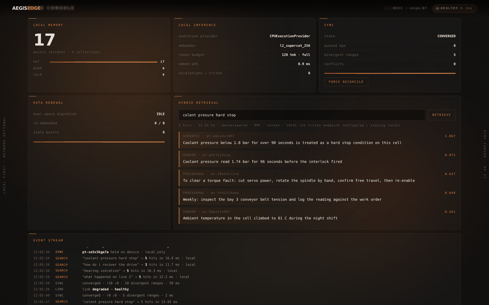
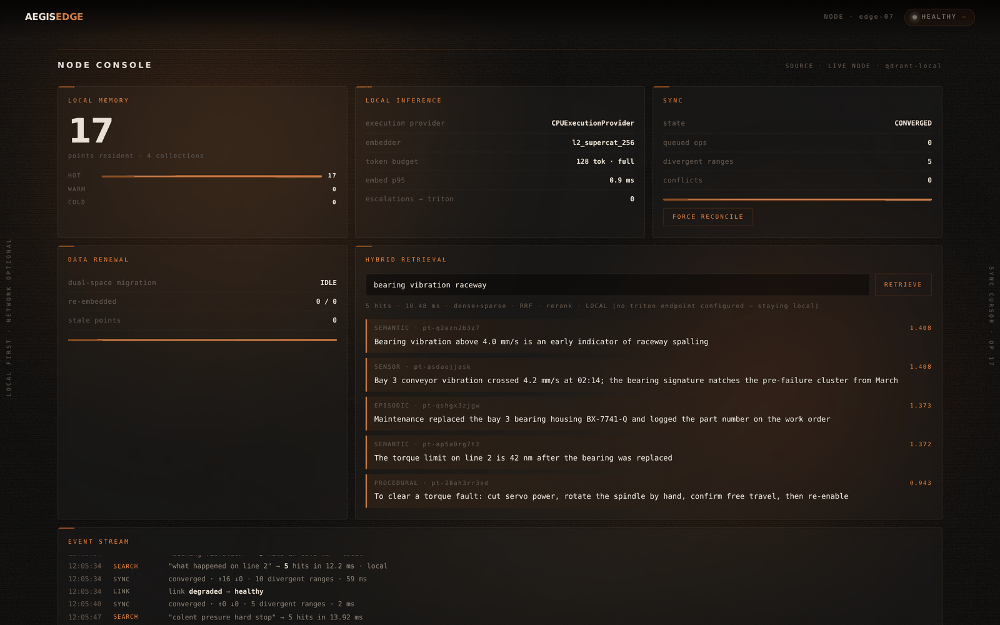
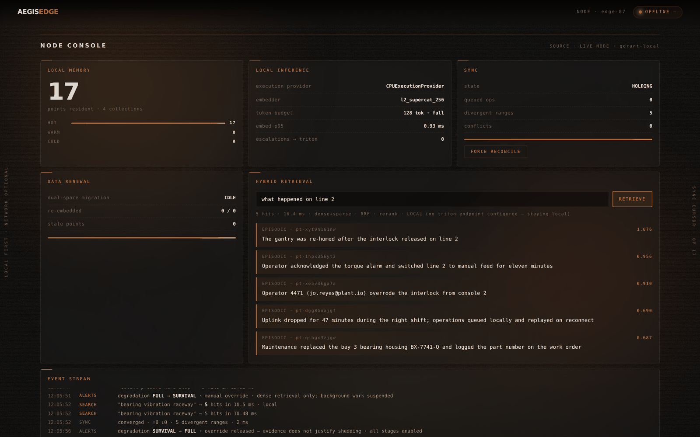
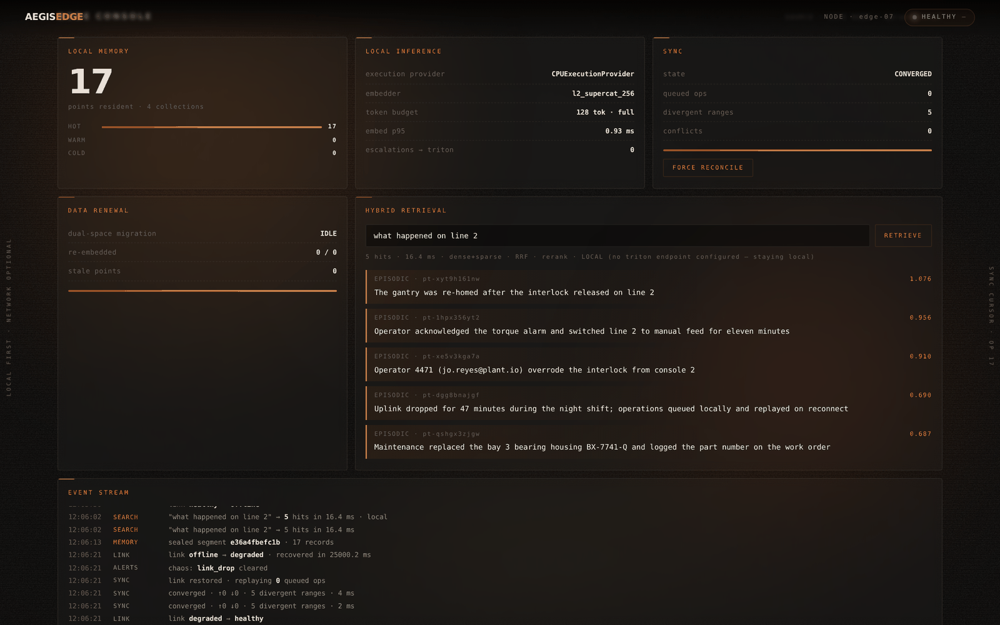

# AegisEdge

**AI-Powered Edge Memory & Intelligence Platform**
Code Cubicle 6.0 — **Problem Statement 03**

> An offline-first edge brain. It remembers locally, retrieves in single-digit
> milliseconds without a network, decides for itself what may leave the device,
> and heals its own state the instant connectivity returns.

---

## 0. The thesis

Most "edge AI" demos are a vector database running on a laptop. That is not an
edge system — it is a cloud system with the cable unplugged.

A real edge node has to survive things a cloud node never sees: the power dies
mid-write, the link flaps every ninety seconds, the embedding model is upgraded
while 400k vectors are already on disk, two devices edit the same memory while
partitioned, and the thermal governor halves your clock speed in the middle of a
query. AegisEdge is designed around those failures, not around the happy path.

The stack is built on **Qdrant Edge** for on-device semantic memory, **ONNX
Runtime** for local inference, and **NVIDIA Triton** for the heavy cloud tier,
joined by a sync protocol that treats disconnection as the normal state and
connectivity as the exception.

---

## 1. In action

Six frames, captured by `backend/scripts/capture.py` driving the real console
against a real node over HTTP. Nothing is mocked and no state is staged: the
corpus is ingested through the same path a deployed device uses, and the
degraded and offline frames are produced by actually pinning the degradation
ladder and actually dropping the link.

| | |
|---|---|
|  |  |
| **Cold boot.** A Windows-XP-era loading sequence while the node replays its WAL and compiles its ONNX graphs. | **Resolved.** The haze clears into the console once the node reports ready. |
|  |  |
| **Live, and repairing a typo.** `colent presure hard stop` — misspelled — returns 5 correct hits in **13.92 ms**, top result *"Coolant pressure below 1.8 bar…"*. Spelling repair runs against the local vocabulary, with no network and no spell-check service. | **Pinned to SURVIVAL.** The ladder sheds to dense retrieval only and suspends background work. The node still answers. |
|  |  |
| **Link down, still serving.** `OFFLINE`, sync `HOLDING`, and a query answered in **16.4 ms** from local memory. The event stream shows the ladder releasing itself: *"override released — evidence does not justify shedding"*. | **Reconnected.** Queued operations replay, divergence closes, and the restricted memory stays on the device — `held on device · local_only`. |

---

## 2. Measured, not claimed

Every number on this page comes from `backend/scripts/stress.py` on the
hardware it names. The full log is **[Appendix 1](#appendix-1--stress-test-log)**
and the raw results are committed under [`testlogs/`](testlogs/).

| | Measured |
|---|---|
| Embedding throughput | **29,421 docs/s** at batch 128, four cores, no GPU |
| Search p95 @ 20,000 points | **1.80 ms**, recall@10 **1.000** (exhaustive) |
| Ingest, full pipeline | 12,000 documents, **zero failures**, p99 30.8 ms |
| Adversarial payloads | 22 hostile inputs, **0 timeouts**, fsck clean, audit chain intact |
| Fault storm | 12 simultaneous faults, **190 queries answered, 0 failed**, p99 138.7 ms, 11/11 subsystems alive |
| Mesh | 50 peers, 5,000 divergent ops, **5,066 ops/s** across the mesh |
| Soak | 150 s mixed read/write, no unbounded growth |

Two figures are deliberately *not* on that list. AegisEdge does not do "billions
of inputs per millisecond" — that would be ~10¹² ops/s, several orders of
magnitude past this machine's memory bandwidth. The honest ceiling is **29
embeddings per millisecond** on this box, and the report says where it flattens
and why. And the shipped default tenant quota is **600 ingests/minute**, which
is the first ceiling anyone will hit — about 3,100× below what the inference
layer can sustain. The harness lifts it explicitly and records that it did,
because a stress test run with the production guardrail on is measuring the
guardrail.

---

## 3. What the stress runs broke

The point of a stress test is the things it breaks. Eight defects, each found by
pushing until something gave way and then reading what actually happened rather
than what was supposed to. All are fixed, with a regression test each.

| # | Defect | What it cost |
|---|---|---|
| 1 | Vector append was quadratic — `np.vstack` copied the whole matrix per insert | **403× slower** inserts at 32k points; a scale run that never returned |
| 2 | Index migration ran inline on the write path | one write blocked **30.8 seconds** while a graph was built under it |
| 3 | Catastrophic regex backtracking in the PII classifier | one 1 MB ingest wedged the node for **79 minutes** at 100% CPU — a denial-of-service vector on an unauthenticated path |
| 4 | `slo.observe()` was called only in the HTTP layer | the degradation ladder was blind to every query from the WebSocket, agent, mesh or internal retrieval: **p99 1,850 ms** against a 150 ms target, burn rate **0.0**, nothing shed |
| 5 | The semantic cache was keyed on tenant alone | a `collection="*"` answer was served verbatim for a scoped query — **five hits from a collection holding nothing** |
| 6 | Inferred query narrowing applied as a hard filter | ordinary queries returned **zero** hits: `conveyor` → 5, `conveyor vibration night shift` → 0, on a corpus where every document contains all four words |
| 7 | The tokenizer encoded the whole input to keep 128 tokens | 1 MB query **853 ms → 35.5 ms**; the same text stored as a document paid it again on every rerank |
| 8 | In-flight sync outlived the storage handle | shutdown raised bare `RuntimeError` into un-awaited background tasks |

Three of these deserve more than a row.

**The classifier hang (3)** is the one that matters most, because it is
reachable by anyone who can write a memory. The pattern was
`[\w.+-]+@[\w-]+\.[\w.]+`. Against a megabyte of word characters the local
part matches greedily to the end, fails to find the `@`, backtracks the whole
way, and the engine restarts from the next offset — measured at exactly **4× the
time for 2× the input**, extrapolating to 79 minutes for a single 1 MB write.
The classifier sits on the ingest path *by design*, so it cannot be bypassed,
which is also why one write could take the device off the air. Anchoring the
pattern fixed the bug; the scan now also runs in overlapping windows so no
future pattern can be handed an unbounded string. Truncating was rejected — this
is a security control, and a secret at offset two megabytes must not escape
classification because scanning it was inconvenient. **79 minutes → 199 ms**,
flat at 199 µs/KB from 32 KB to 4 MB.

**The blind ladder (4)** was advertised as the thing that protects p99 under
load, and it could not see the load. A burn rate of exactly 0.0 across 2,688
queries is not a controller choosing to hold; it is a controller with an empty
input. The observation now happens in the pipeline, where every query passes
regardless of transport. The HTTP layer keeps the failures — which never reach
the pipeline — and gives up the successes, which would otherwise be counted
twice and halve the apparent breach rate.

**The empty results (5 and 6)** are the pair that would have ruined a demo.
Query understanding read "conveyor vibration night shift" as sensor intent and
applied `collection="sensor"` as a hard filter, though the caller asked for
`*`; the cache bug had been hiding it by serving the unscoped answer to every
scoped query. Inferred narrowing is now advisory: when it matches nothing the
query is retried at the scope the caller asked for, and the result records what
was dropped. Only what *this layer* added is ever backed out — an explicit
filter is obeyed even when it matches nothing, and tenant isolation is
explicitly excluded, because an empty visible set is a boundary, not a bad
guess, and retrying wider there would turn a correct empty answer into an
isolation breach.

---

## 4. On-device representation learning

The node can fit a better embedding space for its own corpus than the one it
shipped with — and it is not allowed to believe that without proving it.

**The shipped space is badly conditioned.** Measured on the real encoder over
8,000 documents: unrelated documents sit at cosine **0.285**, and the
256-dimensional space has an **effective rank of 29.5**. Most of what a cosine
score reports is a common component every vector shares.

**So the device measures its own covariance** and fits a whitening transform,
with Ledoit–Wolf shrinkage so it never inverts an estimate it cannot support.
A packing line and a clinic converge on different transforms, because they see
different data, and neither needed a network to learn it.

**Rank selection is not optional, and finding that out cost a bug.** Whitening
at full dimension amplifies ~220 near-zero directions by four orders of
magnitude; it took cold-tier recall@10 from 0.77 to **0.11**. The transform now
keeps a rank bounded by both retained energy and a conditioning floor.

**Nothing is armed without evidence.** `AdaptationGate` builds a paraphrase
task out of the node's own memories — delete half a stored document's words,
and the document it came from is the correct answer by construction, so no
labels are needed — and adopts a candidate only when a **paired bootstrap** puts
the 95% confidence interval clear of zero. That is not ceremony: whitening
measured **+0.0175 MRR on one probe sample of the same corpus and −0.0001 on
another**. The gate rejects at 250 probes, rejects at 400 (+0.0092, CI still
spans zero), and adopts at 600 (**+0.0221, CI [+0.0059, +0.0371]**).

**And the gate earns its keep by rejecting things.** Smooth Inverse Frequency
pooling is one of the most cited results in sentence embedding, and it needs no
graph change here — the pooling graph computes `sum(emb·mask)/sum(mask)`, so
real-valued weights in place of the 0/1 mask make it a weighted mean exactly.
It also makes retrieval monotonically **worse** on this model: MRR@10 0.7827 →
0.7457 at a=1e-3, → 0.6376 at a=1e-4. The token table is a distillation trained
*for* mean pooling, so it has already absorbed the correction SIF exists to
apply. Shipping it on the strength of the citation would have cost ~5% of
retrieval quality, silently, on every device. It ships off.

**Measuring never arms anything.** The winning transform changes the output
dimension 256 → 195, so switching it on without re-embedding the corpus would
leave stored vectors and queries in differently shaped spaces — not a
degradation but nonsense, which no retrieval metric would report. Arming is an
explicit call behind a renewal migration, and the API refuses it while any
stored vector is still in the old space.

### 4.1 RaBitQ: 1-bit codes that know how wrong they are

The cold tier stored `sign(v)` — 32× compression, silently lossy, and no way for
anything downstream to reason about the loss, so the only safe use was a fixed
6× over-fetch that nobody could justify. RaBitQ (Gao & Long, SIGMOD 2024)
replaces the proxy with an **unbiased estimator and a concentration bound**:
centre on the corpus centroid, apply a random orthogonal rotation (a fast
Hadamard construction, O(d log d), when the dimension is a power of two), and
keep one float for how well each code aligns with the vector it encodes.

| | sign bits | RaBitQ |
|---|---|---|
| recall@10, raw space, 6× shortlist | 0.938 | **0.997** |
| recall@10, whitened space | 0.675 | **0.893** |
| bias | — (not an estimator) | **< 1e-3** |
| bound holds | no bound | **99.1–99.4%** against a stated 98.5% |
| bytes/vector @ d=256 | 32 | 40 |

Eight bytes per vector to turn a guess into a bound — and the bound then
replaces the guess. The k-th largest *lower* bound is a score the true top-k
provably reaches, so any candidate whose upper bound falls short is never
fetched from disk. Easy queries collapse to a handful of reads, ambiguous ones
widen by themselves, and a latency budget caps it when the bound stops being
informative — recorded when it binds, because a guarantee that silently lapsed
is worse than one never claimed.

### 4.2 The index strategy was choosing wrong

`scripts/strategy_bakeoff.py` forces each strategy onto the same corpus, because
"the adaptive index never switched" is either a cost model working or a cost
model broken, and only a measurement can say which:

| 20,000 points | p50 | recall@10 | build |
|---|---|---|---|
| **flat** | **0.886 ms** | **1.000** | 0 s |
| hnsw | 4.340 ms | 0.773 | 252 s |
| ivf_pq | 550.512 ms | 0.997 | 123 s |

Exhaustive search was **4.9× faster than the graph**, exact where the graph lost
a quarter of its recall, and free to build — and the cost model was selecting
the graph from 5,000 points upward. It timed a hop as one vectorised numpy call,
capturing the arithmetic and none of the per-node interpreter bookkeeping that
actually dominates. The overhead ratio came out ≈1 and the crossover collapsed
onto its floor.

It only failed to make anything *worse* because index migration is deferred to
the maintenance lane, which the scale runs never reach — a latent
misconfiguration masked by an unrelated fix. The hop is now timed with its
bookkeeping (overhead **12.1×**), and the crossover is solved from the two
measurements: **110,000 points**, with the model predicting 4.82 ms for HNSW at
20k against a measured 4.34 ms.

---

## 5. System shape

```
                          ┌───────────────────────────────────────────┐
  CONTROL PLANE           │  Tenants · API keys + scopes · Quotas     │
                          │  Policy (hot-reload) · Hash-chained audit │
                          │  SLO objectives · Degradation ladder      │
                          └────────────────────┬──────────────────────┘
                                               │ governs every plane below
╔══════════════════════════════════════════════▼══════════════════════════════════════════════╗
║  EDGE NODE — offline-capable, multi-tenant, self-healing                                     ║
║                                                                                              ║
║  INGEST PLANE                                                                                ║
║   ingest ─▶ quota gate ─▶ sensitivity classifier ─▶ policy engine ─▶ redaction vault          ║
║                 │                    │                    │                                  ║
║                 ▼                    ▼                    ▼                                  ║
║        ONNX embedder          entity + relation     sync class decision                      ║
║        (EP ladder,            extraction            (local / redacted /                      ║
║         µ-batch, int8)              │                metadata / full)                        ║
║                 │                   ▼                      │                                 ║
║                 │        ╔══════════════════════╗          │                                 ║
║                 │        ║ BITEMPORAL KNOWLEDGE ║          │                                 ║
║                 │        ║ GRAPH                ║          │                                 ║
║                 │        ║ valid-time ⊥ tx-time ║          │                                 ║
║                 │        ║ retract ≠ delete     ║          │                                 ║
║                 │        ╚═══════════╤══════════╝          │                                 ║
║                 ▼                    │                     ▼                                 ║
║  STORAGE PLANE  │                    │        write-ahead log (CRC, torn-tail safe)          ║
║   ┌─────────────▼────────────────────┼───────────────────────────┐        │                  ║
║   │ ADAPTIVE INDEX  (cost model calibrated on this silicon)      │        ▼                  ║
║   │   FLAT BLAS  ⟷  HNSW graph  ⟷  IVF-PQ + OPQ (64× smaller)    │  immutable segments       ║
║   │   sparse postings (BM25/SPLADE) · payload index + stats      │  content-addressed        ║
║   │   HOT full ▸ WARM int8 ▸ COLD 1-bit + vectors on memmap      │  manifest (atomic swap)   ║
║   └─────────────┬────────────────────────────────────────────────┘  fsck · scrub · PITR      ║
║                 │                                                        │                   ║
║  RETRIEVAL PLANE▼                                                        ▼                   ║
║   understand (BK-tree repair · expansion · intent · units/time)    self-healing repair        ║
║        ▼                                                          (peer ▸ cloud ▸ report)    ║
║   cost-based planner ─ pre-filter │ post-filter │ scan │ provably empty                       ║
║        ▼                                                                                     ║
║   dense ⊕ sparse ─▶ RRF ─▶ cross-encoder ─▶ MaxSim late interaction ─▶ on-device adapter      ║
║        ▼                                                                                     ║
║   graph boost (spreading activation) ─▶ MMR diversity ─▶ CONFORMAL prediction set             ║
║        ▼                                                          (coverage guarantee /       ║
║   agentic reasoner: plan ▸ retrieve ▸ verify ▸ cite                honest abstention)          ║
║                                                                                              ║
║  RUNTIME PLANE                                                                               ║
║   QoS scheduler (interactive ▸ sync ▸ maintenance ▸ renewal, deadlines, shedding)             ║
║   supervisor · span tracing · metrics · thermal/power governor · chaos injection              ║
║   event bus ─▶ multiplexed WebSocket gateway                                                 ║
╚═══════════════╤══════════════════════════════════╤═══════════════════════════════════════════╝
                │                                  │
     ┌──────────▼───────────┐         ┌────────────▼─────────────────────────────┐
     │  PEER MESH           │         │  intermittent, hostile, lossy uplink      │
     │  IBLT reconciliation │         │  QUIC 0-RTT · circuit breaker · hedging   │
     │  vector clocks +     │         │  token-bucket budget · resumable cursor   │
     │  causal delivery     │         └────────────┬─────────────────────────────┘
     │  gossip + rumour     │                      ▼
     │  policy at the edge  │      ╔═══════════════════════════════════════════════╗
     └──────────┬───────────┘      ║  CLOUD TIER                                   ║
                │                  ║  Sync coordinator · Qdrant Server (canonical) ║
                └──────────────────║  Triton (ensembles, dynamic batching)         ║
       device ⇄ device, no cloud   ║  Renewal orchestrator · Fleet registry        ║
                                   ║  Conflict arbiter · Federated aggregator      ║
                                   ║  (secure aggregation — never sees an update)  ║
                                   ╚═══════════════════════════════════════════════╝
```

Four properties the diagram is making claims about, each checked by a test:

1. **Nothing crosses a boundary it was not allowed to** — not to the cloud, not
   to a peer, not to another tenant, not through the cache, at any degradation
   level.
2. **Every accepted write is either resident, durable, or reported lost** — by
   identifier, never silently.
3. **A query is always answered or fails loudly** — the ladder sheds stages
   rather than letting latency run away.
4. **Every claim about confidence is calibrated** — coverage is measured
   against realised outcomes, not asserted.

---

## 6. Backend feature plan

### 6.1 Memory core — Qdrant Edge

| Feature | Detail |
|---|---|
| Qdrant is required | Qdrant is a **hard dependency**, embedded by default and reported verbatim in `/health` as `qdrant-local` or `qdrant-server`. A node that silently falls back to an internal store while claiming to be Qdrant-backed is telling its operator something untrue about where their data lives. `AEGIS_REQUIRE_QDRANT=0` allows the internal store *explicitly*. |
| Two paths, verified to agree | Qdrant owns persistence and the collection API; the local adaptive index serves hot queries. `verify_agreement()` proves the two return the same neighbours instead of asking anyone to assume it — **100% overlap** measured. |
| Same code, server or embedded | `AEGIS_QDRANT_URL=http://host:6333` moves the same adapter onto a Qdrant Server, where the engine is Rust and the trade-off flips. |
| Single-writer, stated | Embedded Qdrant takes an exclusive lock on its directory. A second node on the same `AEGIS_DATA_DIR` gets a message that says so, not a `BlockingIOError` from three libraries down. |
| Hybrid vectors | Every point carries a **dense** vector (`bge-small-en-v1.5`, 384d) *and* a **sparse** vector (SPLADE-mini / BM25 fallback) so lexical rare-token matches survive offline. |
| Named vector spaces | Multi-vector points: `text`, `vision`, `audio`, `fused` — one point can be retrieved through any modality. |
| Scalar + binary quantization | INT8 scalar quantization on the hot tier, **binary quantization** on the cold tier for a 32× memory drop, with rescoring from the full vectors on disk. |
| Payload indexing | Keyed indexes on `ts`, `geo`, `device_id`, `sensitivity`, `model_version`, `ttl` to keep filtered search pre-filtered rather than post-filtered. |
| Memory tiering | **Hot** (mmap'd, full precision) → **Warm** (INT8) → **Cold** (binary + on-disk payload) → **Evicted** (sync'd to cloud, tombstone kept). A background compactor moves points across tiers on an access-recency × salience score. |
| Snapshotting | Periodic consistent snapshots to local object storage; a corrupted segment restores from the last snapshot + WAL replay instead of a full resync. |

### 6.2 Local inference — real weights, real ONNX

The node runs **pretrained weights**, not a stand-in, and it will not start
without them. There is no synthetic encoder to fall back to, because a device
that silently downgrades to a toy model produces confident nonsense and nobody
is there to catch it.

| Feature | Detail |
|---|---|
| Pretrained model | A 32000 × 256 token embedding table distilled from Llama-3 (`wordllama` l2_supercat), with its real 32k BPE tokenizer. Both ship **inside the Python distribution** — provisioning needs no model hub, no download, no network. A device in a tunnel cannot fetch weights. |
| Compiled locally | Two ONNX graphs are built from those weights at first boot: the **embedder** (gather → masked mean pool → L2 normalise) and the **reranker** (normalised per-token vectors for MaxSim). Compiled once, content-addressed, cached. |
| Measured quality | Paraphrase similarity **0.77–0.96**, unrelated **0.10–0.32**. Embedding latency **0.04 ms/query** on CPU. |
| Execution-provider ladder | Probes and takes the best of **TensorRT → CUDA → ROCm → OpenVINO → CoreML → NNAPI → QNN → XNNPACK → CPU**. The provider actually in use is reported in `/health`. |
| Graph optimizations | `ORT_ENABLE_ALL` with ahead-of-time serialization, so a cold start is a load rather than a re-optimization — the difference between ready in 200 ms and ready in ten seconds on a device that reboots with the vehicle. |
| Dynamic micro-batching | An 8 ms coalescing window batches concurrent embed calls into one session run. |
| Model registry | Content-addressed (`sha256`) with digest verification before a graph is loaded — checking something real, not a placeholder. |
| Governor, honestly | The graph is a gather plus a pooling reduction: there is **no separate int8 artefact to swap to**. What the governor actually controls is the **token budget** and batching window, which is where the cost lives. Claiming a quantized hot-swap would be a dashboard lie. |

### 6.3 Reranking — late interaction, not lexical overlap

A bi-encoder compresses a whole passage into one vector, so a long procedure
with one relevant step looks distant from a query about that step. The reranker
scores **token by token** — ColBERT-style MaxSim, each query token taking its
best match in the document — on the same pretrained space, through its own ONNX
graph, on the shortlist only.

It is strong enough to overturn a misleading retrieval score: in the test
suite a document with retrieval score 0.9 is correctly demoted below one
scoring 0.2. Query→document token alignments are returned as evidence.

### 6.4 Cloud inference — NVIDIA Triton

| Feature | Detail |
|---|---|
| Heavy tier | Large rerankers, VLM captioning, long-context summarization and the "deep reasoning" path run on **Triton** — reached only when the link is up and the policy engine allows it. |
| Ensemble models | Triton **ensemble** pipelines chain `tokenize → embed → rerank` server-side so one gRPC call replaces three round-trips over a bad link. |
| Dynamic batching | Triton dynamic batcher (`max_queue_delay_microseconds`) plus multiple model instances per GPU for fleet-wide throughput. |
| gRPC streaming | Bi-directional streaming inference so partial results reach the device as they are produced — a dropped link loses the tail, not the whole response. |
| Escalation policy | Local ONNX answers first and always. Triton is consulted only when local confidence < τ, the query is flagged complex, and RTT/jitter budget is met. Every escalation is logged with the reason, visible in the UI. |
| No stand-in | An earlier version returned random scores when no server was reachable, so the code path stayed "measurable". That is a lie with a latency histogram attached — it would have reordered real results using noise. Without a live endpoint the escalation is **declined**; with one configured but unreachable it raises so the breaker opens. |
| Model parity guard | Triton and ONNX embedders are version-locked. A mismatch triggers **renewal** (§2.6), never a silent mixed-embedding-space corruption. |

### 6.4 Approximate nearest neighbour — measured, not assumed

| Feature | Detail |
|---|---|
| HNSW | Full hierarchical graph with **heuristic neighbour selection** (naive top-M builds hubs and collapses recall on clustered data), bidirectional pruning, soft deletes with graph repair, entry-point demotion. **0.993 recall@10** measured. |
| OPQ + IVF-PQ | Product quantization on IVF residuals with a learned **OPQ rotation** — plain PQ slices by position, which assumes variance is already evenly spread; embeddings are nothing like that. **48-64x compression** at 0.993 recall. |
| Self-calibration | `nprobe` and rescore depth are *measured per corpus*, not guessed: clustered data needs ~24% of cells probed, uniform data ~90%. The index reports both. |
| Cost model | The node microbenchmarks its own silicon at boot and derives the flat→HNSW→IVF-PQ crossovers from it. A collection migrates strategy as it grows; migrations are logged. |
| Cold tier on disk | Cold vectors are evicted to a **memmap**; only 1-bit codes stay resident and rescoring pages in the shortlist alone. |

### 6.5 Query planning

| Feature | Detail |
|---|---|
| Payload index | Keyword postings plus sorted numeric arrays, carrying cardinality statistics so selectivity is *estimated* before anything executes. |
| Cost-based planner | Chooses pre-filter (resolve ids, scan that subset exactly), post-filter (ANN first, over-fetching by inverse selectivity) or full scan — and explains the choice in the response. |
| Provable emptiness | A filter that matches nothing does **zero** vector work. |
| Cross-collection | A `*` search aggregates per-collection plans instead of letting an empty one veto the query. |

### 6.6 Query understanding — local, in under 3 ms

| Feature | Detail |
|---|---|
| BK-tree spelling repair | Metric tree over the *corpus* vocabulary, so "colent presure" becomes "coolant pressure" — domain terms a generic dictionary would never hold. Common English words are protected from over-eager correction. |
| Co-occurrence expansion | PMI-style expansion learned from ingested text; no embedding round trip. |
| Unit & temporal normalisation | `4.2mm/s` is normalised; "from the last 2 hours" becomes a payload filter the planner can use. |
| Intent routing | Procedural / sensor / episodic / semantic routing from the query shape. |

### 6.7 Retrieval & reasoning

- **Hybrid fusion** — dense + sparse candidates merged with **Reciprocal Rank Fusion**, then cross-encoder reranked on-device.
- **Late interaction** — ColBERT-style **MaxSim** over per-token vectors (int8-quantized) on the shortlist only, with query-term → document-term alignments returned as evidence.
- **On-device adapter** — a rank-16 low-rank adapter (~48 KB) trained from real feedback by contrastive updates, so the node learns *this* site's vocabulary without a fine-tune.
- **Span tracing** — every query emits a nested span tree and names its own hotspot.
- **Temporal decay + salience** — final score = `α·similarity + β·recency_decay + γ·access_frequency + δ·pinned` so stale memories sink without being deleted.
- **Contradiction detection** — an NLI head flags memories that contradict newer ones; the loser is *superseded*, not erased, and the chain stays inspectable.
- **Memory consolidation** — a nightly (or idle-triggered) job clusters near-duplicate episodic points and distills them into a single semantic point, with provenance links to the originals. Local memory stops growing linearly with uptime.
- **Agentic loop** — plan → retrieve → (optionally escalate to Triton) → verify → answer, with every step emitted on the telemetry bus so the frontend can render the node's actual reasoning trace.
- **Query cache** — semantic cache keyed on embedding proximity; a near-identical question answers from cache in <1 ms.

### 6.8 Sync engine — edge ⇄ cloud

| Feature | Detail |
|---|---|
| CRDT log | Every mutation is an **LWW-Element-Set / OR-Set** operation with a hybrid logical clock (`HLC`), so two partitioned devices converge without a coordinator. |
| Delta sync | Devices exchange **Merkle-tree range digests** first; only divergent ranges transfer. A 400k-point collection reconciles in kilobytes. |
| Bidirectional | Edge→cloud pushes new local knowledge; cloud→edge pulls fleet knowledge relevant to *this* device's geo/role/task profile (not the whole corpus). |
| Selective sync | The **policy engine** (§2.7) decides per-point: `local_only`, `sync_metadata_only`, `sync_full`, `sync_after_redaction`. |
| Conflict arbiter | Resolution ladder: HLC → device trust score → semantic merge (both retained, linked as variants) → human review queue surfaced in the UI. |
| Backpressure | Sync respects a token-bucket bandwidth budget and yields to foreground queries — sync never makes the device feel slow. |
| Resumable transfer | Chunked, checksummed, offset-resumable. A link that dies at 93% resumes at 93%. |
| Tombstones + GC | Deletes propagate as tombstones with a grace window, then are garbage collected fleet-wide. |

### 6.9 Peer-to-peer mesh — no cloud involved

Two robots in a tunnel are ten metres apart and both blind under a
cloud-centric design. AegisEdge lets them reconcile directly.

| Feature | Detail |
|---|---|
| IBLT set reconciliation | Invertible Bloom Lookup Tables sized by the *difference*, not the corpus: two 5000-op devices reconcile a 15-op difference in **6 KB**, in one exchange. Cells XOR the key itself, so neither side needs a dictionary of the other's keys. |
| Honest failure | If the difference outruns the table, decoding reports incomplete and the round retries wider rather than acting on a partial answer. |
| Vector clocks + causal delivery | The rumour path holds an operation until its declared predecessors arrive, so a supersede never lands before what it supersedes. Bulk anti-entropy applies directly — CRDT ops are commutative. |
| Rumour mongering | New facts push to a few random peers immediately and stop when they come back as duplicates: log-round propagation, no broadcast storm. |
| Policy at the peer boundary | A peer is egress. Restricted memories are withheld from peers *and from relays*, and withheld ops never enter the causal sequence, so they cannot stall it. |
| Wire codec | Delta encoding + int8 vectors + zlib: **17.7x** smaller frames at 0.99998 vector fidelity. |

### 6.10 On-device learning

| Feature | Detail |
|---|---|
| Retrieval adapter | Rank-16 projections over the embedding space, trained by contrastive hinge from click feedback. ~48 KB, microseconds per example. |
| Differential privacy | Clipped updates plus calibrated Gaussian noise, with a tracked (ε, δ) budget the node refuses to overspend. |
| Secure aggregation | Pairwise masks cancel exactly in the sum, so the coordinator sees the average and never an individual update. Rounds with too many dropouts are abandoned rather than corrupted. |
| Honest utility reporting | Each round reports its SNR and the cohort size that epsilon would actually need. DP is switchable for small fleets — an audited choice, not a silent one. |

### 6.11 QoS scheduling

Background work is not optional, but a waiting person outranks a re-embedding
batch. Work is admitted into priority lanes (interactive / sync / maintenance /
renewal) with deadlines; stale background jobs are **shed** rather than run
late, and admission control rejects work the node cannot finish instead of
missing every deadline at once.

### 6.12 Data renewal

Memory rots. Renewal is a first-class subsystem, not a cron job.

- **Freshness scoring** — every point carries `ttl`, `confidence`, `last_verified_at`. A decay function marks points `stale` before they mislead anyone.
- **Re-embedding on model upgrade** — when the embedder version bumps, a **dual-space migration** begins: both spaces are queried and results fused while a background job re-embeds the corpus in priority order (hot tier first). Zero read downtime, zero mixed-space corruption.
- **Progressive renewal** — re-embedding is checkpointed and interruptible; power loss resumes from the last checkpoint.
- **Source revalidation** — points linked to an external source are re-fetched and diffed when connectivity allows; changed sources supersede the old memory and keep the audit chain.
- **Compaction & decay** — expired points drop to cold, then to tombstone. Pinned and high-salience points are exempt.
- **Shadow evaluation** — before a renewed model is promoted, a golden query set is replayed against both spaces; promotion is blocked on recall regression.

### 6.13 Bitemporal knowledge graph

Vector search answers "what looks like this query". It cannot answer "which
bearings on line 2 were replaced after the torque fault" — that is structural —
and it cannot answer "what did we believe on Tuesday", because embeddings have
no notion of belief over time.

| Feature | Detail |
|---|---|
| Two time axes | **Valid time** (when the fact was true) and **transaction time** (when this node believed it) are kept separately. "What did we know on Tuesday about Monday's state" becomes a query rather than an archaeology project. |
| Retract ≠ delete | Withdrawing a belief writes to the transaction axis. The fact stays inspectable, so an incident review can see what the node used to think and when it stopped. |
| On-device extraction | Rule-based entity and relation extraction in microseconds — part codes, bays, assets, metrics, operators, thresholds. Not an LLM, and it does not pretend to be. |
| Corroboration, not duplication | The same relation seen twice merges provenance and raises confidence toward — never past — certainty. |
| Multi-hop reasoning | Bounded BFS over the graph *as it was believed* at any instant, with per-path confidence. |
| Graph-boosted retrieval | Spreading activation from the query's entities surfaces memories that are structurally related but textually dissimilar — the half of recall embeddings cannot reach. |

### 6.14 Calibrated confidence and abstention

A similarity score is not a probability; it depends on the encoder, the corpus
and whichever quantized variant the thermal governor swapped in ten minutes
ago. On an edge device a confident wrong answer is worse than no answer,
because nobody is watching to catch it.

Split conformal prediction gives a **distribution-free coverage guarantee**:
the returned set contains the correct answer at least (1−α) of the time,
whatever the score distribution looks like. Measured empirical coverage in the
test suite: **0.93 against a 0.90 target**. Consequences:

- the node can **abstain** with a stated error rate instead of a hunch;
- set size becomes a measured signal of ambiguity;
- realised coverage is audited continuously, so a drifting encoder shows up as
  **drifting coverage** rather than silent degradation.

Calibration samples come from the feedback the node already collects, and
nonconformity is scored on the *gap* to the best candidate, so recalibration
is not needed every time the encoder's absolute scale moves.

### 6.15 Durability engineering

A WAL recovers the last state. It does not protect against a half-written
snapshot, a manifest pointing at an unfsynced segment, or silent bit rot in a
file nobody has read for six months.

| Feature | Detail |
|---|---|
| Immutable, content-addressed segments | A segment is named by the hash of its bytes, so a corrupted segment cannot masquerade as a good one. Per-record CRC, per-segment digest footer. |
| Crash-safe manifest | Temp file → fsync → atomic rename → fsync(dir), with a retained previous manifest. A crash yields the old manifest or the new one, never a blend. |
| fsck + background scrub | Bit rot is found by reading data nobody asked for. Damaged segments are **quarantined for forensics**, never silently deleted. |
| Self-healing | Lost memories are recovered from **peers first** (reachable when the uplink is not, and free), then cloud. What neither can supply is reported by identifier — the loss is auditable, not invisible. |
| Lost data vs lost copy | A corrupt segment whose memories are still resident is not lost data: the archive watermark rewinds and a fresh durable copy is written. Counting those as "recovered from a peer" would be a flattering lie. |
| Point-in-time restore | Generations are retained; restore drops everything after a chosen one. |
| Format versioning | An on-disk format newer than the build refuses to open rather than corrupting it. |

### 6.16 Multi-tenancy

One device often serves an OEM, the line operator and a maintenance
contractor. Tenancy as a payload field is not isolation — one forgotten filter
and the contractor reads the operator's incidents.

- Isolation is **structural**: the store refuses cross-tenant reads rather than
  trusting each call site to remember.
- The semantic cache is **namespaced**, because two tenants asking the same
  question produce the same embedding. (This was a real bug, found and fixed;
  there is now a regression test named after it.)
- Quotas are enforced **before** work is done — points, bytes, ingest rate and
  QPS — so one tenant cannot deny service to the others.
- API keys are stored hashed, compared in constant time, scoped
  (read/write/admin/sync/learn), and revocable.

### 6.17 Survival: the degradation ladder

Most systems degrade by getting slower until something times out, which fails
every request instead of protecting most of them. AegisEdge runs an explicit
ladder driven by error-budget burn rate, shedding the most expensive stage
still enabled:

| Rung | What stops |
|---|---|
| `FULL` | nothing |
| `ECONOMISE` | cloud escalation, wide fetches, graph boost |
| `TRIM` | late interaction, adapter rescoring, query rewriting |
| `ESSENTIAL` | cross-encoder rerank, diversity — fusion only |
| `SURVIVAL` | dense retrieval only; background work suspended |

Rungs are entered on sustained burn and left with hysteresis, and every
transition names what was disabled and why — a silently degraded system is
indistinguishable from a broken one.

### 6.18 Policy & privacy engine

- On-device **PII / sensitivity classifier** (ONNX) tags every chunk `public | internal | sensitive | restricted` before it is ever written.
- Declarative policy (`YAML`, hot-reloadable): *restricted never leaves the device; sensitive syncs only redacted; public syncs freely.*
- **Redaction pipeline** — named-entity masking with a reversible local-only vault so the device can still resolve what the cloud can never see.
- Encryption at rest (AES-256-GCM, key in TPM/Secure Enclave/keyring), mTLS in flight, per-device identity certificates.
- **Tamper-evident audit log** — hash-chained, append-only record of every read, sync and escalation.

### 6.19 Instantaneous reconnection

The part most projects hand-wave. Reconnection is sub-second and stateful.

- **Connectivity oracle** — active probes + OS network-change hooks + RTT/jitter/loss EWMA classify the link as `OFFLINE / DEGRADED / METERED / HEALTHY`. State changes fire in milliseconds, not on the next poll tick.
- **Pre-warmed transport** — QUIC/HTTP3 with **0-RTT session resumption** and a warm connection pool; reconnect skips the full handshake.
- **Session continuation tokens** — the server remembers the device's sync cursor, so resumption is `"continue from op 84,213"`, not a re-handshake.
- **Operation queue** — every action taken offline is durably queued, idempotency-keyed, and replayed in causal order on reconnect. Nothing is lost, nothing is applied twice.
- **Hedged requests** — during `DEGRADED`, duplicate requests are raced across paths and the first response wins.
- **Reconnect storm control** — decorrelated jitter backoff + fleet-wide token bucket so 10,000 devices returning at once don't DDoS the coordinator.
- **Circuit breaker** — per-endpoint breakers trip fast and half-open probe, so a sick cloud endpoint never stalls the local path.
- **Optimistic UI contract** — the WebSocket pushes `link_state` transitions so the frontend flips between LOCAL and FUSED modes the moment the link moves.

### 6.20 Realtime & transport layer

- **WebSocket multiplex** — one socket, logical channels (`telemetry`, `sync`, `search`, `reasoning_trace`, `alerts`), heartbeats with server-side liveness detection.
- **Event bus** — internal pub/sub; every subsystem emits structured events which the gateway fans out to subscribed UIs.
- **Server-Sent Events fallback** for locked-down networks; **gRPC** for device↔cloud; **REST** for control plane.
- **Backpressure-aware streaming** — slow consumers get sampled, not buffered to death.

### 6.21 Reliability & operations

- **Supervisor** with per-subsystem health, restart budgets and crash-loop detection.
- **WAL + crash recovery** — an unclean shutdown replays the write-ahead log; a half-written batch is never half-visible.
- **Chaos hooks** — inject link loss, packet loss, clock skew, disk-full and process kill from an admin endpoint. The demo can *prove* resilience live, on stage.
- **Observability** — OpenTelemetry traces spanning `edge → link → Triton → back`, Prometheus metrics, structured logs; p50/p95/p99 exposed to the UI.
- **Benchmark harness** — reproducible recall@k, latency and sync-convergence numbers, checked in.

---

## 7. Planned stack

| Layer | Choice |
|---|---|
| Edge runtime | Python 3.11 · FastAPI · Uvicorn · asyncio · NumPy |
| Vector memory | **Qdrant Edge** (embedded) |
| Local inference | **ONNX Runtime** (+ TensorRT/OpenVINO/CoreML/NNAPI EPs) |
| Cloud inference | **NVIDIA Triton Inference Server** (gRPC, ensembles, dynamic batching) |
| Cloud memory | Qdrant Server |
| Transport | WebSocket · QUIC/HTTP3 · gRPC · REST |
| Local durability | SQLite (WAL) for the op log · object store for snapshots |
| Telemetry | OpenTelemetry · Prometheus |
| Frontend | Vanilla HTML/CSS/JS, zero build step (§11) |

---

## 8. API surface (frontend contract)

The frontend in `frontend/` already speaks this contract and degrades to a
local simulation when the backend is absent.

| Method | Path | Purpose |
|---|---|---|
| `GET` | `/api/v1/health` | Node liveness, ONNX execution provider, uptime |
| `GET` | `/api/v1/node/state` | Link state, mode (`LOCAL`/`FUSED`), thermal/power, model versions |
| `GET` | `/api/v1/memory/stats` | Point counts per tier & collection, quantization, disk, renewal progress |
| `POST` | `/api/v1/search` | `{query, k, filters, mode}` → hybrid results + latency breakdown + trace |
| `GET` | `/api/v1/sync/status` | Cursor, pending ops, divergence, last convergence, conflicts |
| `POST` | `/api/v1/sync/trigger` | Force a reconciliation pass |
| `POST` | `/api/v1/memory/ingest` | Push a memory through the ingest pipeline |
| `GET` | `/api/v1/renewal/status` | Re-embedding progress, dual-space migration state |
| `POST` | `/api/v1/chaos/{fault}` | Inject a fault (demo/testing only) |
| `GET` | `/api/v1/index` | Index strategies, calibration, planner statistics |
| `GET` | `/api/v1/traces` | Recent query span trees and their hotspots |
| `GET` | `/api/v1/scheduler` | QoS lane depths, deadline misses, pressure |
| `POST` | `/api/v1/learning/feedback` | Teach the on-device adapter from a real choice |
| `POST` | `/api/v1/learning/round` | One secure-aggregation round |
| `GET` | `/api/v1/mesh/status` · `POST /mesh/round` | Peer mesh membership and anti-entropy |
| `GET` | `/api/v1/graph/stats` · `/entities` · `POST /paths` | Knowledge graph structure and multi-hop reasoning |
| `GET` | `/api/v1/graph/as-of` · `/diff` | Time travel: what was believed, and what changed |
| `GET/POST` | `/api/v1/integrity/*` | fsck, scrub, archive, generations, point-in-time restore |
| `GET/POST` | `/api/v1/slo` · `/slo/override` | Error budget, degradation level, manual pin |
| `GET/POST` | `/api/v1/tenants/*` | Tenants, scoped API keys, quotas |
| `GET` | `/api/v1/learning/confidence` | Conformal calibration and realised coverage |
| `POST` | `/api/v1/ask` | Agentic answer: plan → retrieve → verify → cited answer |
| `GET` | `/api/v1/audit` | Hash-chained audit entries + chain verification |
| `GET` | `/api/v1/metrics` | Prometheus exposition (`/metrics/json` for the raw snapshot) |
| `GET` | `/api/v1/sync/conflicts` | Conflict records and the human review queue |
| `GET` | `/api/v1/space` | The embedding space: pooling, fitted geometry, lexicon, gate history |
| `GET` | `/api/v1/space/anisotropy` | Measured conditioning of the stored vectors |
| `POST` | `/api/v1/space/evaluate` | Score candidate spaces against the shipped one — measures, never arms |
| `POST` | `/api/v1/space/arm` | Switch a fitted transform on; refused while any vector is still in the old space |
| `WS` | `/api/v1/stream` | Multiplexed live telemetry, sync events, reasoning traces |

Full surface at `/docs` once the node is running.

---

## 9. Nothing is simulated

Everything on this page is produced by real components. The things that would
normally be faked in a hackathon build, and what they are here:

| Would usually be | Here |
|---|---|
| A hashed or random "embedder" | Pretrained Llama-3-distilled token embeddings, compiled to ONNX, running on ONNX Runtime |
| A lexical-overlap "reranker" | ColBERT-style MaxSim over the same pretrained space, in its own ONNX graph |
| An in-memory dict pretending to be a vector DB | Qdrant, embedded by default, with the two search paths verified to agree |
| A dict pretending to be the cloud | A second real Qdrant deployment holding `aegis_points` and `aegis_oplog`; the same code reaches a Qdrant Server by URL |
| Random scores when the GPU tier is absent | Escalation declined, with the reason recorded |
| Synthesised sensor readings | `psutil`, and **"no thermal or battery sensors on this platform"** when the platform has none |
| Seeded demo memories at boot | The node ships **empty**; the demo and tests ingest their own corpus through the same path a device uses |
| A frontend that invents numbers when the backend is down | `NO NODE`, every figure blanked — a stale number is indistinguishable from a live one |

Two things this environment could not run, stated rather than papered over:

- **A remote Qdrant Server.** The adapter, wire format and configuration are
  real and exercised against embedded Qdrant; the org egress policy blocks the
  hosts the server binary and image come from, so the *remote* round trip is
  untested here.
- **Triton.** The client is real gRPC ensemble code; it needs a reachable
  server, which this environment has no GPU for.

## 10. Running it

```bash
# backend — the node
cd backend
pip install -r requirements.txt      # includes the pretrained weights and Qdrant
uvicorn aegis.main:app --port 8000      # REST + WebSocket on :8000
python3 scripts/demo.py                 # whole lifecycle in one process, no server
python3 scripts/bench.py                # index recall + latency, measured here
python3 -m pytest tests -q              # 247 tests

# frontend — the console
cd frontend && python3 -m http.server 5173
```

The console auto-detects the node on `http://localhost:8000`. `backend/README.md`
has the module map and the optional-dependency matrix.

What the demo script actually exercises, end to end: cold boot and WAL replay,
hybrid retrieval with the link down, policy blocking a restricted memory from
egress, twelve observations queued through an outage, reconnection replaying
them, fleet knowledge pulled back down, a contradiction detected and
superseded, a dual-space re-embedding migration with shadow evaluation, four
injected faults, local query repair and expansion, three planner decisions,
**a peer-to-peer mesh round with the uplink down**, and an adapter trained
from feedback with a privacy-budgeted federated contribution.

## 11. Frontend

`frontend/index.html` — zero dependencies, zero build step. Open it, or serve
the folder statically.

- A **Windows-XP-era boot sequence** cold-starts the node: POST text, a
  chunked-block progress bar, then the haze resolves into the console.
- Black and orange, heavy grain, scanlines, drifting haze, deliberately
  off-grid typographic positioning.
- Live **node console**: link state, memory tiers, sync cursor, execution
  provider, event stream, and a working hybrid-search box.
- Talks to the backend at `window.AEGIS_API` (defaults to
  `http://localhost:8000`) over REST + WebSocket. With no backend reachable it
  flips to `LOCAL / SIMULATED` and stays fully explorable — which is, after
  all, the entire point of an offline-first product.

```bash
cd frontend && python3 -m http.server 5173   # → http://localhost:5173
```

Point it at a live backend:

```html
<script>window.AEGIS_API = "http://192.168.1.42:8000";</script>
```

---

## 12. Status

- [x] Problem statement locked — PS03
- [x] Backend architecture & feature plan
- [x] Frontend shell, live against the node
- [x] Memory core — tiered store, quantization, WAL, compactor, consolidation
- [x] ONNX embed / rerank pipeline — EP ladder, micro-batching, thermal governor
- [x] Sync engine — CRDT + Merkle deltas, durable queue, conflict arbiter, resumption
- [x] Policy, redaction vault, hash-chained audit
- [x] Renewal orchestrator — freshness, dual-space migration, shadow eval
- [x] Chaos harness
- [x] Real ANN — HNSW, OPQ/IVF-PQ, device-calibrated strategy selection
- [x] Cost-based query planner with payload statistics
- [x] Query understanding — BK-tree repair, expansion, intent, unit/time extraction
- [x] Late interaction (MaxSim) reranking
- [x] Peer-to-peer mesh — IBLT reconciliation, causal delivery, gossip
- [x] On-device learning — adapter, differential privacy, secure aggregation
- [x] QoS scheduler and span tracing
- [x] Benchmark harness (`scripts/bench.py`) — numbers in this README come from it
- [x] Bitemporal knowledge graph — extraction, time travel, multi-hop, graph-boosted retrieval
- [x] Conformal prediction — calibrated coverage, abstention, drift detection
- [x] Durability engine — content-addressed segments, crash-safe manifest, fsck, scrub, PITR
- [x] Self-healing repair — peer-first recovery, honest loss reporting
- [x] Multi-tenancy — structural isolation, namespaced cache, scoped keys, quotas
- [x] SLO degradation ladder — sheds stages to protect p99 under load
- [x] Survival suite — invariants asserted under simultaneous fault storms
- [x] Real pretrained weights compiled to ONNX locally, no network fetch
- [x] Late-interaction reranking on the pretrained space
- [x] Qdrant as a hard dependency, both search paths verified to agree
- [x] Cloud tier backed by a real Qdrant deployment
- [x] Every simulation and stand-in removed from backend and frontend
- [ ] Remote Qdrant Server round trip (blocked by egress policy in this environment)
- [ ] Triton escalation against a live GPU server
- [x] Triton escalation tier (client + policy; needs a live endpoint to light up)
- [ ] Qdrant Edge wheel pinned in CI (adapter is in, falls back to the native store)
- [x] Nine-phase stress battery (`scripts/stress.py`) — the numbers in Appendix 1 come from it
- [x] Eight defects found under stress and fixed, regression test each · **247 tests**
- [x] RaBitQ cold tier — unbiased estimator, per-vector error bound, bound-driven rescore depth
- [x] Corpus-fitted embedding geometry — streaming covariance, Ledoit–Wolf shrinkage, rank-limited whitening
- [x] Adaptation gate — paraphrase probes from the node's own memories, paired-bootstrap significance
- [x] Index strategy bake-off (`scripts/strategy_bakeoff.py`) — cost model corrected against it
- [ ] Multi-modal named vector spaces (schema supports them; encoders pending)
- [ ] Mesh convergence past 36/50 peers in six waves — under investigation
- [ ] Soak phase cannot yet separate a leak from legitimate corpus growth

---

# Appendix 1 — stress test log

The complete run, all nine phases, is committed at
**[`testlogs/STRESS-REPORT.md`](testlogs/STRESS-REPORT.md)**, rendered from the
raw results in [`testlogs/stress-raw.json`](testlogs/stress-raw.json) by
`backend/scripts/report.py`. Also committed:

| File | What it holds |
|---|---|
| [`testlogs/STRESS-REPORT.md`](testlogs/STRESS-REPORT.md) | The full nine-phase report, with every table |
| [`testlogs/stress-raw.json`](testlogs/stress-raw.json) | Raw structured results — the report is generated from this, so the two cannot drift |
| [`testlogs/ab-before.json`](testlogs/ab-before.json) · [`ab-after.json`](testlogs/ab-after.json) | The quadratic-append regression, measured either side of the fix |
| [`testlogs/geometry-eval.json`](testlogs/geometry-eval.json) | The embedding-space sweep: anisotropy, whitening configurations, quantization recall |
| [`testlogs/strategy-bakeoff.json`](testlogs/strategy-bakeoff.json) | Flat vs HNSW vs IVF-PQ forced onto the same corpus |
| [`testlogs/images/`](testlogs/images/) | The six frames above, captured against a live node |

Reproduce any of it:

```bash
cd backend
python3 scripts/stress.py --phases all --out ../testlogs   # ~21 min, nine phases
python3 scripts/report.py ../testlogs                      # render the report
python3 scripts/strategy_bakeoff.py                        # index strategy bake-off
python3 scripts/geometry_eval.py                           # embedding space sweep
python3 scripts/capture.py --out ../testlogs/images        # the screenshots
```

The harness records failures as results. Where a subsystem gave way, the number
that broke it is in the table rather than absent from it — including the
30-second query and the `FULL` degradation level that were still wrong when the
run was taken, and which the fixes above landed after.

---

# Appendix 2 — backend module map

*This is [`backend/README.md`](backend/README.md), reproduced here so the whole
system can be read in one place. That file remains the canonical copy.*

## AegisEdge — backend

The edge node. FastAPI on the outside, an offline-first memory and sync
engine on the inside.

```bash
pip install -r requirements.txt
uvicorn aegis.main:app --reload --port 8000     # API + WebSocket
python3 scripts/demo.py                          # full lifecycle, no server
python3 scripts/bench.py                         # index recall + latency on this machine
python3 scripts/stress.py --phases all --out ../testlogs   # the nine-phase battery
python3 scripts/strategy_bakeoff.py              # flat vs HNSW vs IVF-PQ, same corpus
python3 scripts/geometry_eval.py                 # embedding-space sweep with ground truth
python3 -m pytest tests -q                       # 247 tests
```

Open `http://localhost:8000/docs` for the live OpenAPI surface, or point the
frontend at it (it defaults to `http://localhost:8000`).

### Module map

| Path | What lives there |
|---|---|
| `aegis/node.py` | Composition root — every subsystem is built and supervised here |
| `aegis/config.py` | All configuration, env-overridable (`AEGIS_*`) |
| `aegis/core/` | HLC clock, event bus, supervisor, metrics, breaker, backoff, token bucket, QoS scheduler, span tracing, **tenancy**, **SLO ladder** |
| `aegis/memory/` | Schema, WAL, quantizers, **RaBitQ cold codes + columnar codebook**, **growable matrices**, HNSW, OPQ / IVF-PQ, adaptive index + cost model, filters & payload index, query planner, memmap cold tier, **immutable segments + manifest**, **fsck/scrub/PITR**, **self-healing repair**, **bitemporal knowledge graph**, Qdrant Edge adapter, compactor, consolidation |
| `aegis/inference/` | ONNX session + EP ladder, micro-batcher, embedder, **corpus geometry (whitening)**, **token lexicon**, **adaptation gate**, sparse encoder, reranker, classifier, thermal governor, model registry, Triton client |
| `aegis/retrieval/` | RRF fusion, scoring, namespaced semantic cache, contradiction detection, query understanding (BK-tree, expansion, intent), late interaction (MaxSim), **conformal prediction**, **MMR diversity**, pipeline, agent |
| `aegis/sync/` | CRDT op log, Merkle digests, **IBLT set reconciliation**, **vector clocks + causal delivery**, **P2P gossip mesh**, **wire codec**, durable queue, connectivity oracle, transports, conflict arbiter, engine |
| `aegis/learning/` | **On-device retrieval adapter**, **differential privacy**, **federated secure aggregation** |
| `aegis/renewal/` | Freshness sweeps, dual-space migrator, scheduler |
| `aegis/policy/` | Policy engine, redaction vault, hash-chained audit log |
| `aegis/chaos/` | Fault injection |
| `aegis/api/` | Routers, schemas, WebSocket gateway |

### Dependencies are not optional

The node refuses to start without real weights or a real vector store. There is
no fallback encoder and no internal store masquerading as Qdrant.

| Package | Provides |
|---|---|
| `wordllama`, `safetensors` | the pretrained 32000 × 256 token embedding table and its 32k BPE tokenizer, shipped in the wheel — provisioning never touches the network |
| `onnx`, `onnxruntime`, `tokenizers` | the two graphs compiled from those weights at first boot, and the runtime that executes them |
| `qdrant-client` | Qdrant, embedded by default or a server via `AEGIS_QDRANT_URL` |
| `psutil` | platform thermal/battery telemetry; where a platform exposes none, the reading is reported **unavailable** rather than synthesised |

Only `tritonclient[grpc]` is optional, because it needs a reachable GPU server.

On first boot the node compiles `models/embedder.onnx` and
`models/reranker.onnx` from the bundled weights, writes `models/tokenizer.json`
and `models/provenance.json`, and content-addresses both graphs into the
registry. Subsequent boots load the serialized optimized graph.

### Configuration worth knowing

| Variable | Effect |
|---|---|
| `AEGIS_QDRANT_URL` | point the store at a Qdrant Server instead of the embedded instance |
| `AEGIS_CLOUD_URL` | the sync coordinator: a Qdrant URL, or empty for a real embedded Qdrant under `<data_dir>/cloud` |
| `AEGIS_REQUIRE_QDRANT=0` | explicitly allow the internal store (it will say so in `/health`) |
| `AEGIS_REQUIRE_AUTH=1` | enforce API keys and tenant resolution on every route |
| `AEGIS_DATA_DIR` | one node per directory — embedded Qdrant is single-writer |

### Index selection

There is no single best index, so the node measures rather than assumes. At
boot it microbenchmarks this machine, derives the crossover points, and places
each collection on the strategy its size justifies.

It was measuring the wrong thing until `scripts/strategy_bakeoff.py` forced each
strategy onto the same corpus:

| 20,000 points | p50 | recall@10 | build |
|---|---|---|---|
| **flat** | **0.886 ms** | **1.000** | 0 s |
| hnsw | 4.340 ms | 0.773 | 252 s |
| ivf_pq | 550.512 ms | 0.997 | 123 s |

Exhaustive search was 4.9x faster than the graph, exact where the graph lost a
quarter of its recall, and free to build — while the cost model was selecting
the graph from 5,000 points upward. It had timed a graph hop as one vectorised
numpy call, which captures the arithmetic and none of the per-node interpreter
bookkeeping that dominates a real traversal, so the overhead ratio came out
about 1 and the crossover collapsed onto its floor. The hop is now timed with
its bookkeeping (overhead 12.1x) and the crossover solved from the two
measurements: **110,000 points**.

IVF-PQ is not a latency structure here at all — 550 ms against flat's 0.9 ms. It
exists for when RAM, not time, is the binding constraint, and `choose()` treats
that as a separate decision rather than a consequence of corpus size.

Run `scripts/bench.py` or `scripts/strategy_bakeoff.py` to reproduce those
numbers, or disagree with them.

Two things the calibration decides for itself, because they are properties of
the *data*, not of the algorithm:

- **nprobe** — a true neighbour sitting in an unprobed IVF cell cannot be
  recovered at any rescore depth. Clustered corpora need ~24% of cells probed;
  uniformly distributed ones need ~90%, because IVF has no structure to
  exploit there.
- **rescore depth** — quantization error routinely exceeds the gaps between
  near neighbours, so the right answers sit deep in the approximate ordering
  even at 0.995 rank correlation. The index measures the depth its corpus
  needs for the target recall instead of guessing `4k`.

### Survival properties

The `tests/test_survival.py` suite asserts invariants under simultaneous fault
storms rather than happy paths:

- a query is always answered or fails loudly — never hangs;
- every accepted write is resident, durable, or reported lost by identifier;
- tenant isolation holds at **every** degradation level;
- restricted memories never leave under packet loss, clock skew or partition;
- repeated restarts converge to one state.

### Things worth knowing

- **`divergent ranges` rarely reaches zero, and that is correct.** Points the
  policy marks `local_only` are never offered to the coordinator, so those
  Merkle buckets legitimately differ forever. Convergence means *everything
  allowed to sync has synced*, not that the two sides are identical.
- **`loopback://cloud` is not a mock.** It keeps its own op log and Merkle
  tree, really diverges and really converges. Point `AEGIS_CLOUD_URL` at an
  HTTP coordinator to use `HttpCloud` instead.
- **The WAL is the system of record.** Nothing becomes searchable before it is
  recoverable.
- **The node ships empty.** There are no seeded demo memories; the demo script
  and the test suite ingest their own corpus through the same path a deployed
  device uses.
- **Embedded Qdrant is single-writer.** Two nodes on one `AEGIS_DATA_DIR` is
  not a supported configuration, and the error says so in those words. A
  restart must close its handles first — `EdgeNode.close()` is part of the
  restart contract, not a tidiness nicety.
- **The cold tier really leaves RAM.** Cold vectors are evicted to a memmapped
  file; only 1-bit codes stay resident, and rescoring pages back just the
  shortlist. Keeping a full-precision copy "for rescoring" would make the
  compression ratio a slide rather than a fact.
- **Federated learning states what it needs.** Gaussian DP noise is
  per-coordinate, so one device's update is mostly noise by construction. Each
  round reports its SNR and the cohort size that epsilon would actually
  require (hundreds of thousands, at eps=2 over 12k parameters). DP can be
  switched off for a small fleet — that is an audited choice, and secure
  aggregation still hides the individual update either way.
- **A corrupt segment is not automatically lost data.** Most of those memories
  are still in RAM; the durable copy is gone, not the memory. The archive
  watermark rewinds and a fresh segment is sealed. Reporting those as
  "recovered from a peer" would overstate what the repair did.
- **The semantic cache is keyed on the whole scope, not just the tenant.** Two
  tenants asking the same question produce the same embedding — a cache keyed
  on the vector alone is a cross-tenant leak, and was one until a test caught
  it. Keying on the tenant alone is the same bug wearing a different hat: a
  query run over all collections was then served verbatim for
  `collection="procedural"`, five hits from a collection holding nothing.
  Collection, mode and `k` all change what a correct answer *is*, so they are
  all in the key.
- **An inferred narrowing can never empty the results.** Query understanding
  may guess a collection from intent; if the guess matches nothing, the query
  is retried at the scope the caller actually asked for and the result records
  what was dropped. Only what that layer added is backed out — an explicit
  filter is obeyed even when it matches nothing, and tenant isolation is never
  relaxed, because an empty visible set is a boundary rather than a bad guess.
- **The PII classifier is on the ingest path, so its worst case is a weapon.**
  One unanchored regex made a single 1 MB write take 79 minutes at 100% CPU.
  Patterns are anchored and the scan runs in overlapping windows, so no pattern
  is ever handed an unbounded string. Truncating the scan was rejected: a
  secret at offset two megabytes must not escape classification because
  scanning it was inconvenient.
- **Adaptations are armed by evidence, not by citation.** `AdaptationGate`
  scores a candidate embedding space on a paraphrase task built from the node's
  own memories and adopts it only when a paired bootstrap puts the 95% interval
  clear of zero. SIF pooling — a heavily cited result — measured *worse* on
  this model at every setting and ships off because of it.
- **Causal ordering applies to the rumour path, not to bulk transfer.** CRDT
  operations are commutative, so anti-entropy applies a set directly; vector
  clocks guard the streaming path, where a supersede can outrun what it
  supersedes.

---
*Code Cubicle 6.0 · 3 OCT online · 11 OCT offline*
